# NALC and USPS Correspondence application documentation

## New NALC Correspondence
### Create New Correspondence
<kbd>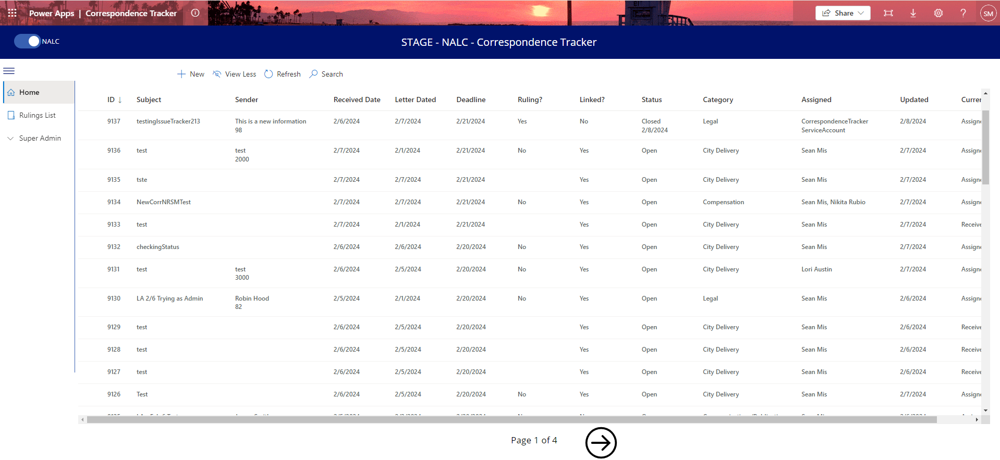</kbd>

To begin, click on the "+ New" button

### Enter Correspondence Details
<kbd>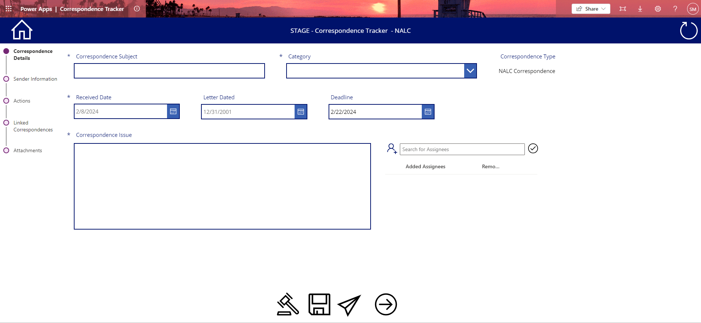</kbd>

Here you can see the Correspondence Details form page, with text boxes for Subject and Issue, a dropdown for Category, and date pickers for Received, Letter Dated, and Deadline dates

### Select Assignee(s)
<kbd>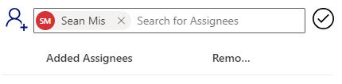</kbd> 

There is also a picker for Assignees -- you can begin typing the name of the Assignee and their name will appear -- select their name to assign them to this Correspondence, and add as many Assignees as necessary

NOTE: Be sure to click the checkbox, as this is how to add an Assignee to your new Correspondence -- failing to do so will create a Correspondence without an attached Assignee

<kbd>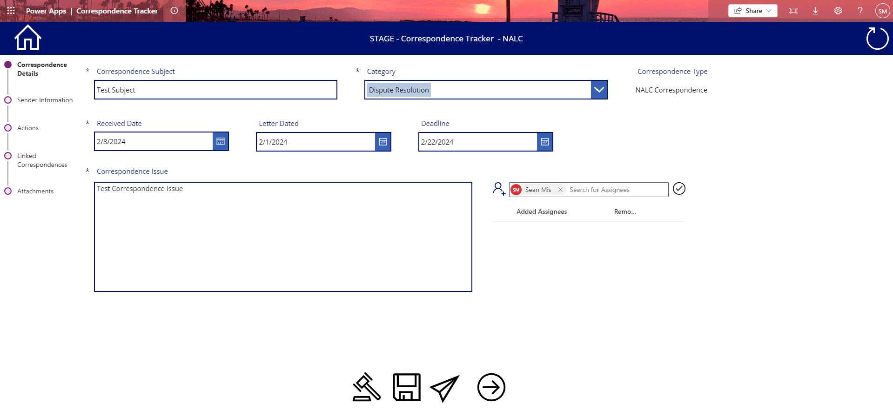</kbd>

After entering all of your text and selecting the Category, dates, and Assignee, you can click on the right arrow (or click on Sender Information on the left side) to progress to Sender Information 

Note: a new NALC Correspondence ID will be created once you click the next arrow or on Sender Information -- until this point, an ID has not been created and your text and selections have not been saved, but your text and selections in Correspondence Details will be saved when you progress to Sender Information

### Sender Information
<kbd>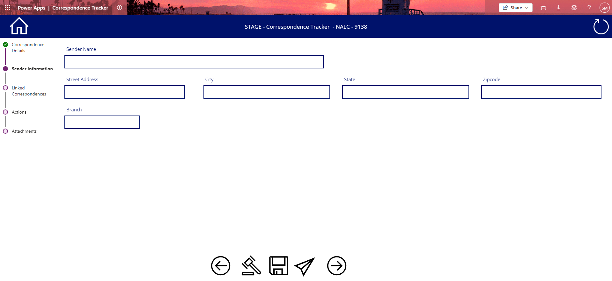</kbd>

Here you can see the Sender Information form page, with text boxes for Sender Name, Street Address, City, State, Zipcode, and Branch

<kbd>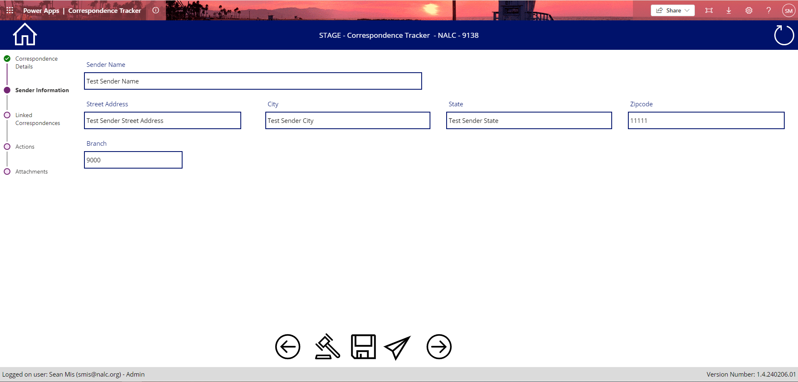</kbd>

After entering all of your text, you can click on the right arrow (or click on Actions) to progress to Actions

### Actions
<kbd></kbd>

Here you can see the page for adding and maintaining Actions

<kbd>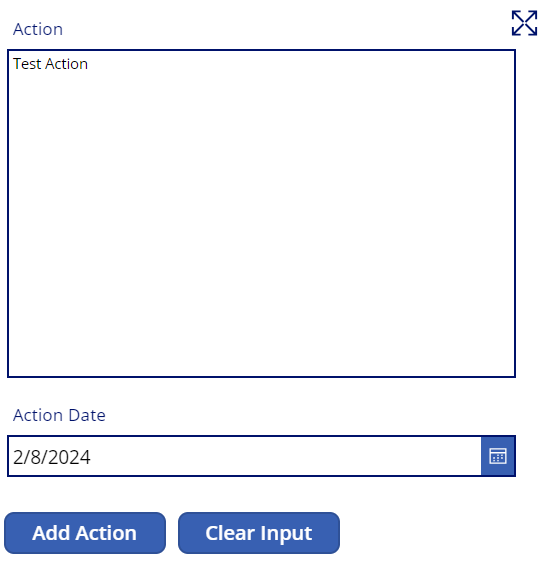</kbd> 

To begin, enter your Action details in the large text box -- click the expand button in the top right corner to see your Action in an expanded view, if necessary -- and select your Action Date from the date picker, then click Add Action to insert your Action in the Action list on the left side of the page

<kbd>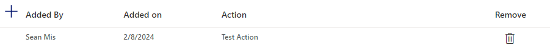</kbd>

Here you can see your Action, with the creator of the Action, date the Action was added, Action details -- you can click on the Remove icon to permanently delete this Action

<kbd>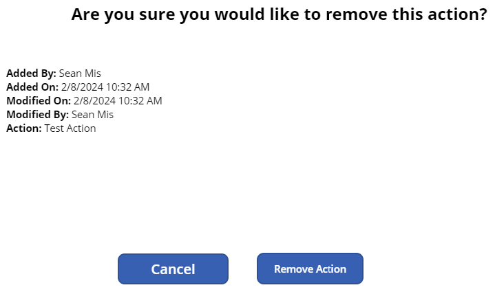</kbd>

If you clicked on the Remove icon you will see this pop-up confirmation screen -- click Remove Action to permanently delete this Action

<kbd>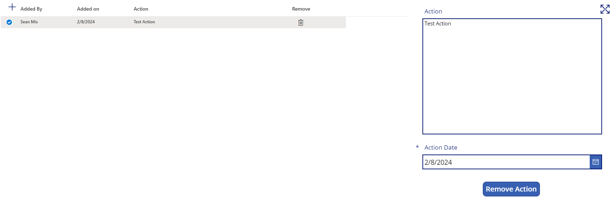</kbd>

Click on the next arrow (or click on Linked Correspondences) to progress to Linked Correspondences

### Linked Correspondences
<kbd>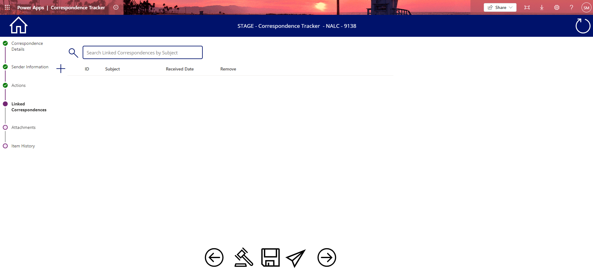</kbd>

Here you can see the page for adding Linked Correspondences to your new Correspondence -- click the plus "+" icon to add a new Linked Correspondence

<kbd>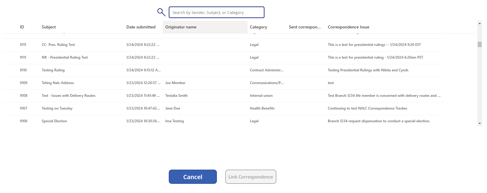</kbd>

Here you can see the list of all Correspondences available to be linked -- double-click on the Correspondence of your choice to link it to your new Correspondence -- you can search for any Correspondence by beginning to type in any details of the Correspondence that you're looking for: Sender Name, Subject, or Category

<kbd>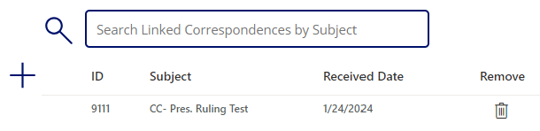</kbd>

Here you can see the Correspondence that you selected and that is now linked to your new Correspondence

<kbd>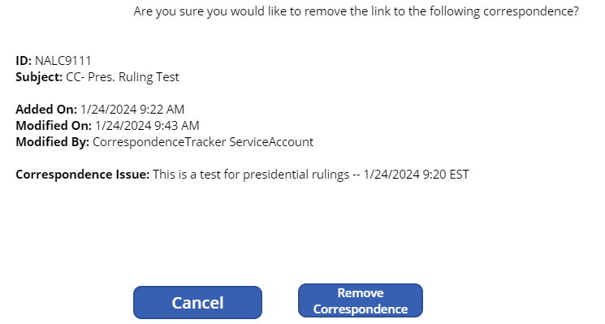</kbd>

To delete a linked Correspondence, click the Remove icon, and you will see this pop-up confirmation screen -- click Remove Correspondence to permanently delete this link to another Correspondence

### Attachments
<kbd>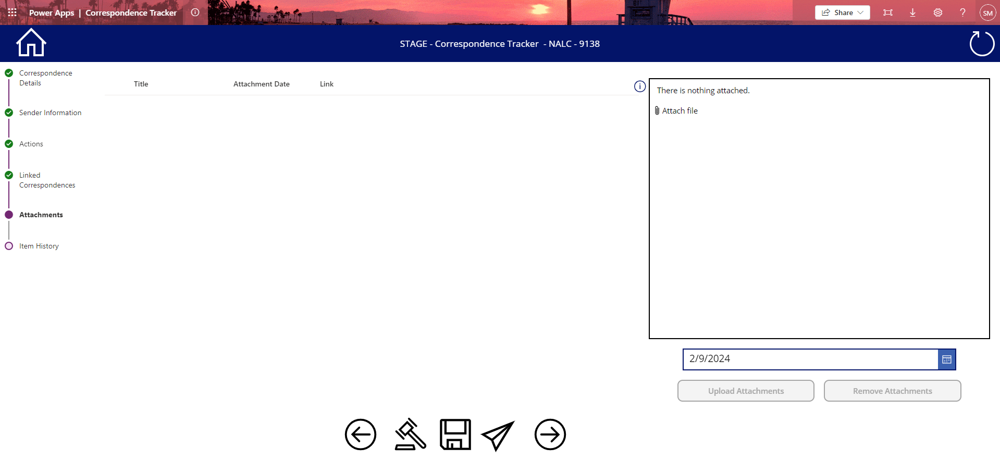</kbd>

Here you can see the page for adding Attachments to your new Correspondence -- click the paperclip/Attach file to attach Word or PDF files

<kbd>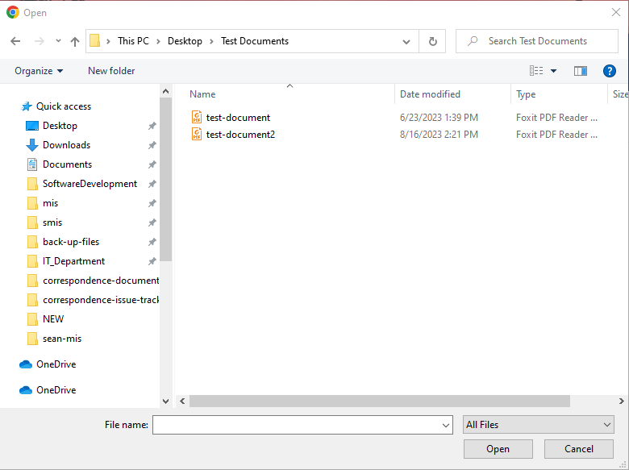</kbd>

Here you can see Windows Explorer window that allows you to navigate to the file of your choice on your local PC -- click OK when you've located and selected the file

<kbd>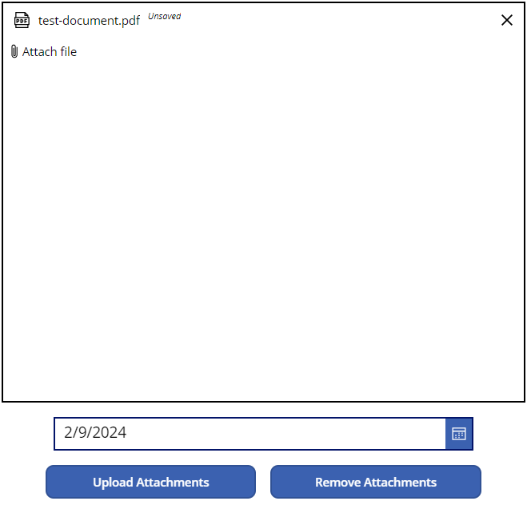</kbd>

Now you can see the file name, with the text "Unsaved" -- add any additional attachments necessary for this new Correspondence

<kbd>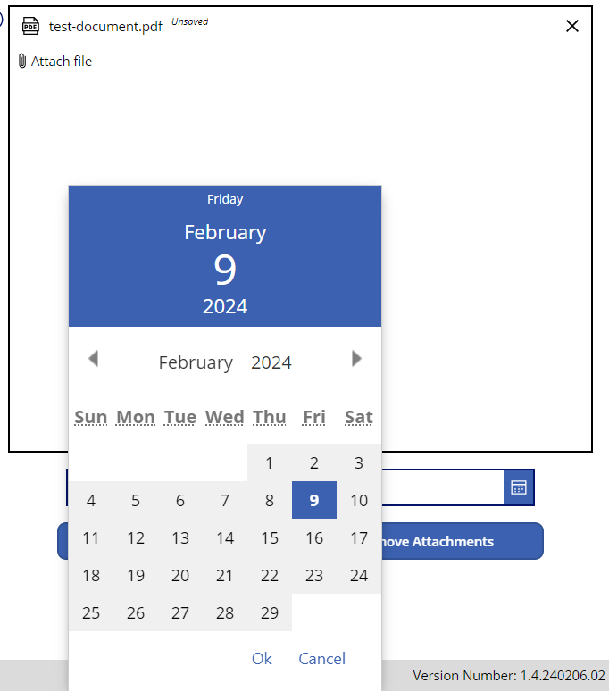</kbd>

To select a date to be associated with your uploaded Attachment(s) click on the date picker and select a date of your choice

<kbd>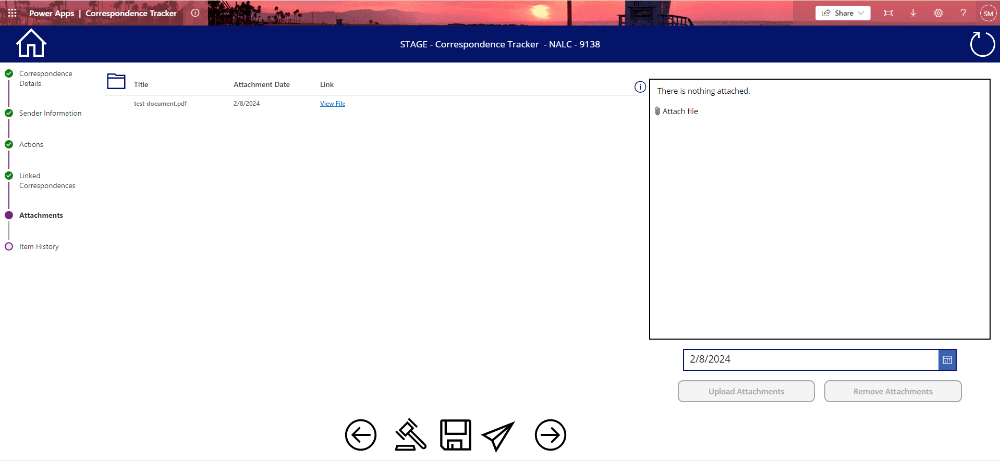</kbd>

After selecting a date and then clicking the Upload Attachments button, you can now see your attachments in the list on the left side of the page

<kbd>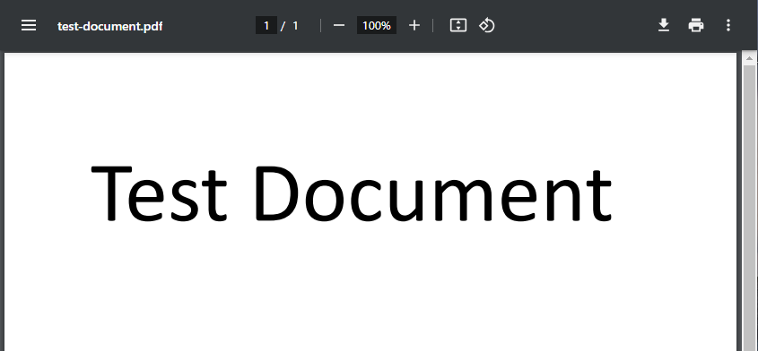</kbd>

You can click on the View File link to view the uploaded file -- a new browser tab will open and your document will appear

<kbd>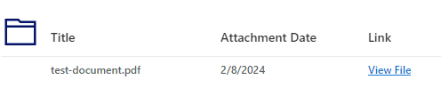</kbd>

To view your upload in SharePoint, you can click on the blue folder icon in the top left corner (near the Title and Attachment Date of your attachment)

<kbd>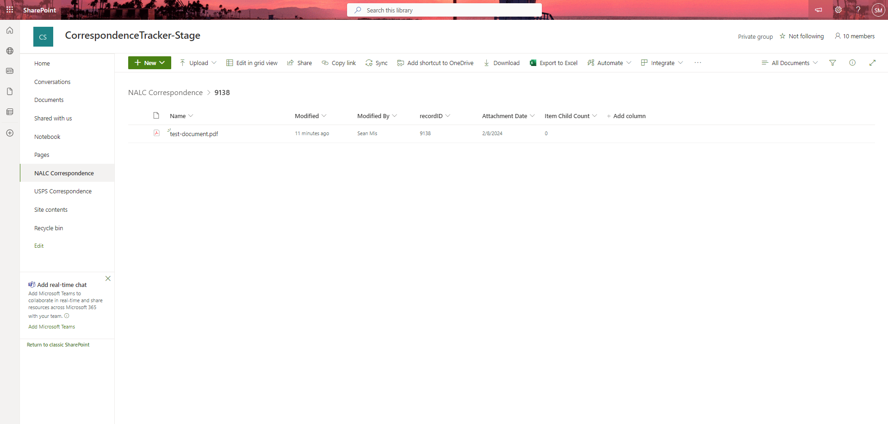</kbd>

Here you can view all uploaded files in SharePoint associated with this Correspondence, and you can also delete files in this location

### Item History
<kbd>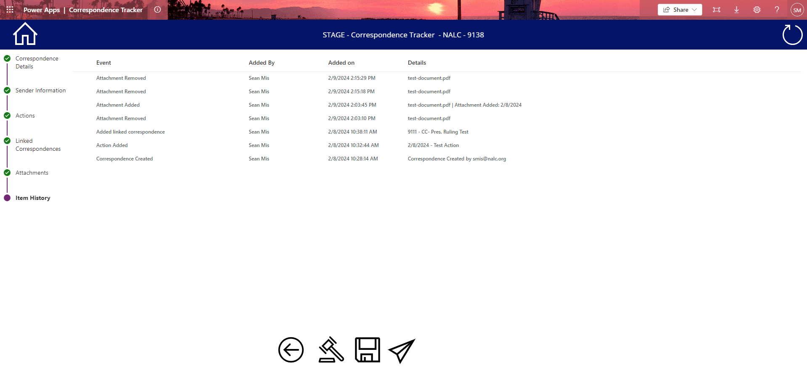</kbd>

Here you can see all the events in the Item History -- every executable action during the creation of your new Correspondence can be seen here

## Edit NALC Correspondence
### Select Correspondence to Edit
<kbd></kbd>

To begin, double click on the row of the Correspondence that you would like to edit

NOTE: You can search for the Correspondence that you'd like to edit by typing in the ID in the search bar, or you can search by Category, Subject, etc.

### Edit Correspondence Details
<kbd>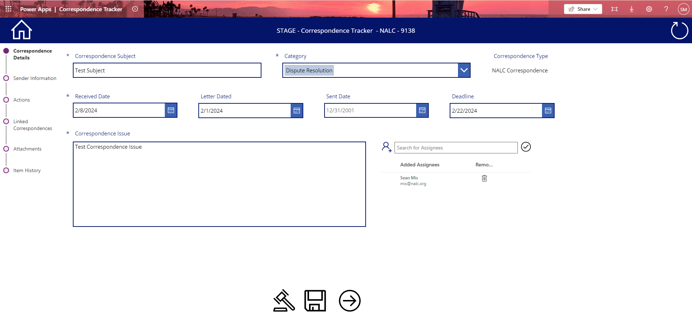</kbd>

Here you can see all the fields populated with data for the Correspondence that you're editing -- begin typing in the Subject or Issue text boxes to update the data, select a new Category from the drop-down, change the dates from the date pickers, or search for and add a new Assignee -- click the next arrow to save and continue editing, or the "Disk" icon to save and exit

### Edit Sender Information
<kbd>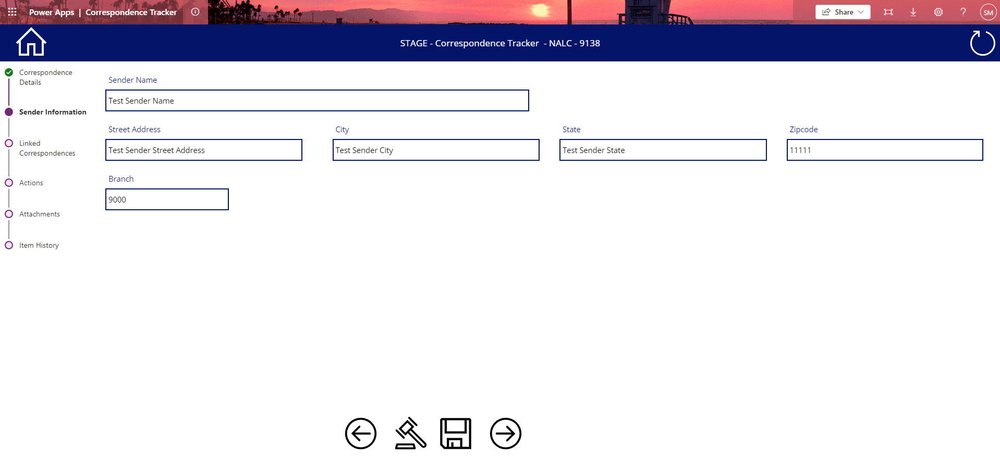</kbd>

Here you can see all the fields populated with data for the Sender: Name, Address, City, State, Zipcode, and Branch -- begin typing in any of the fields to update the data -- click the next arrow to save and continue editing, or the "Disk" icon to save and exit

### Edit Actions
<kbd>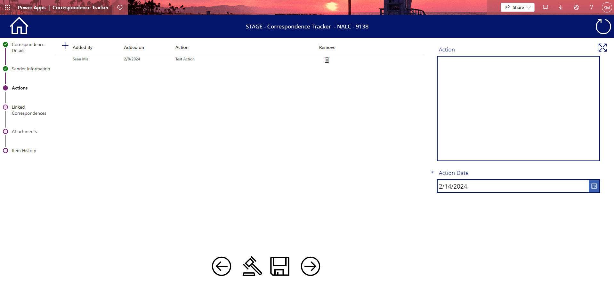</kbd>

Here you can see any Actions that were created for this Correspondence -- you can click on the Action and view its details on the right side (where you can update the details or the Action date), you can add a new Action by clicking on the '+' icon in the top right, or you can delete an Action by clicking the remove icon

### Edit Linked Correspondences
<kbd>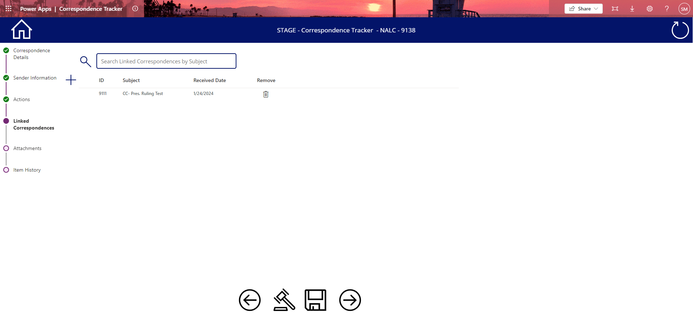</kbd>

Here you can see all of any Correspondences that are linked to the Correspondence that you are editing -- to remove a linked Correspondence, click the remove icon, and to link another Correspondence, click the '+' icon at the top right, and select the Correspondence of your choice  -- you can search for any Correspondence by beginning to type in any details of the Correspondence that you're looking for: Sender Name, Subject, or Category

### Edit Attachments
<kbd>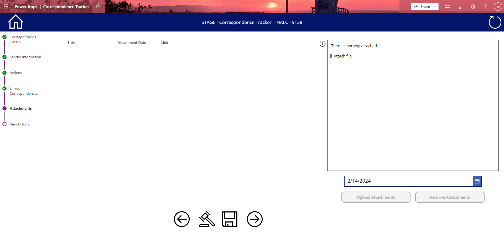</kbd>

Here you can see any files that were attached to this Correspondence -- you can remove an attachment by selecting it and then clicking the Remove Attachments button on the bottom right side -- you can add a new Attachment by clicking on Attach file and browsing your local PC for the file of your choice

### Item History Edits
<kbd>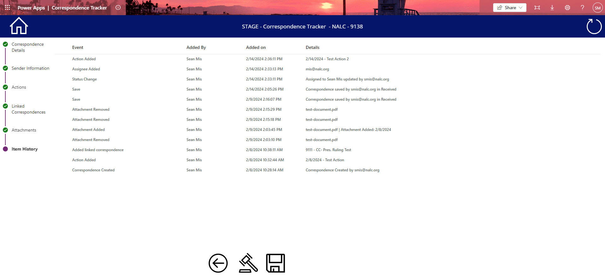</kbd>

Here you can view the item history as well as any additional edits made to this Correspondence

## Presidential Rulings
### Create New Presidential Ruling
<kbd></kbd>

To begin, from inside the Correspondence of your choice you can click on the Gavel icon, and this action will take you to a new Presidential Ruling that will be associated with your NALC Correspondence

<kbd></kbd>

### Presidential Ruling Details
<kbd>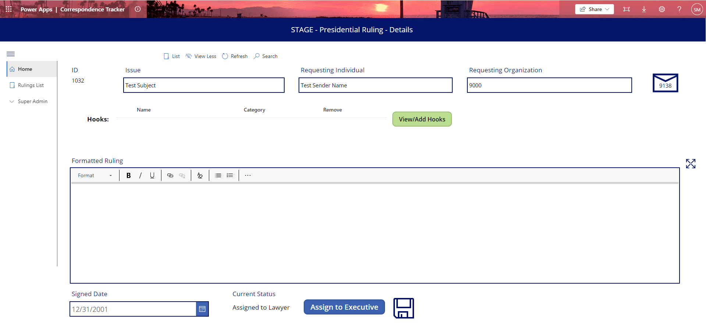</kbd>

Here you can see the entry screen for creating your Presidential Ruling, with text boxes for the Issue, Requesting Individual, Requesting Organization, and Formatted Ruling, as well as a date picker for the Signed Date

### View/Add Hooks
<kbd>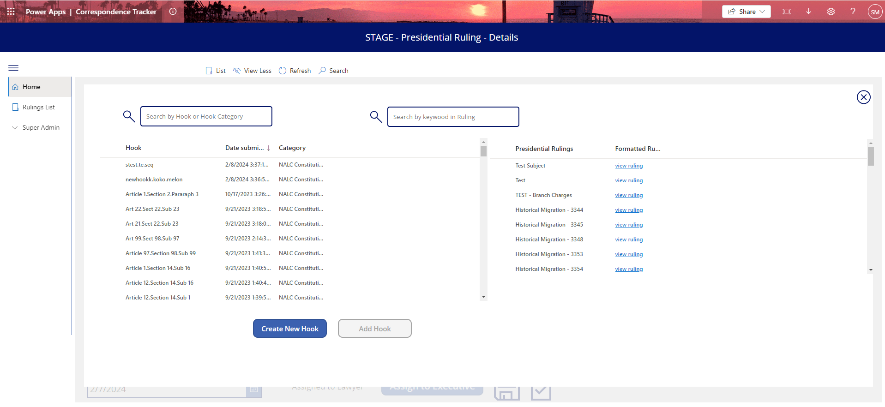</kbd>

To add a new or view a hook, click on the green View/Add Hooks button -- here you can see the list of previously created Hooks (if any) -- to create a new Hook, click the Create New Hook button

### New Hook Details
<kbd>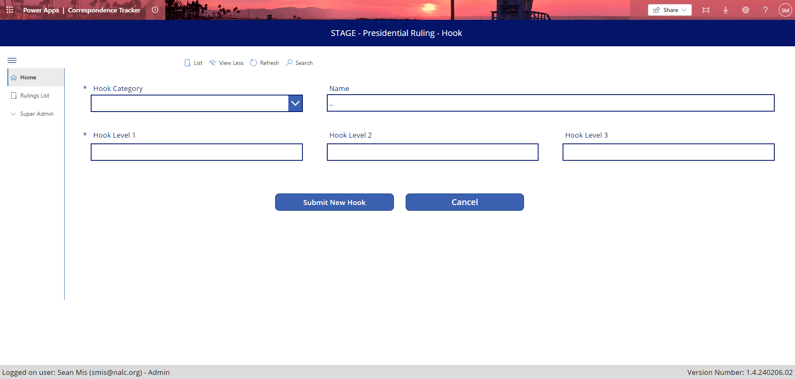</kbd>

To add details for your hook, select a Category from the drop down and enter details for Hook Levels 1-3 in the text boxes

NOTE: the Hook Name will self-populate based on the descriptions entered for Hook Levels 1-3

<kbd>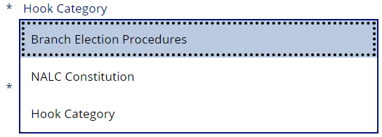</kbd>

Here you can see the different Hook Categories to choose from

<kbd>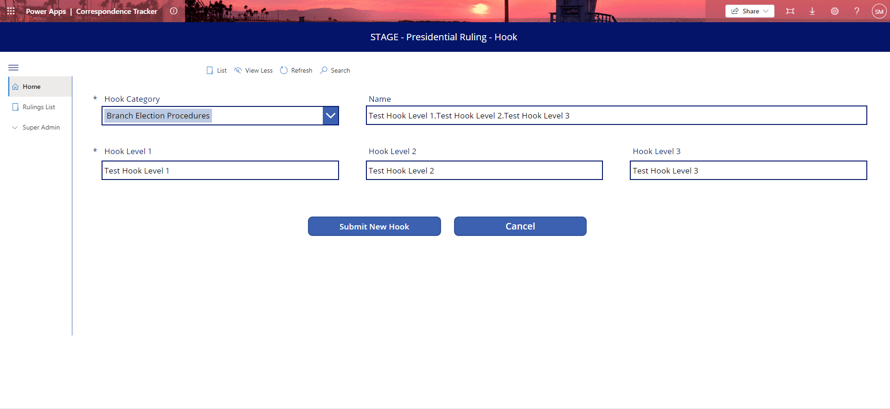</kbd>

Here you can see the filled out form for creating a new Hook -- note how the Name is Hook Levels 1-3, appended with two periods

<kbd>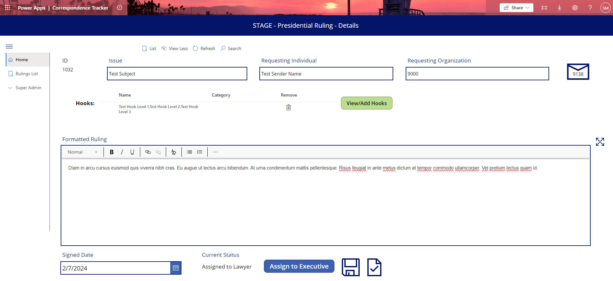</kbd>

Back on the Details page, you can add a Formatted Ruling and select a Signed Date from the date picker, and you can either: save and return to your Presidential Ruling at another time; or you can click Assign to Executive to notify the executive that they have a new Presidential Ruling to review

## NALC Correspondence -- Assignee
### Select Correspondence to Review
<kbd>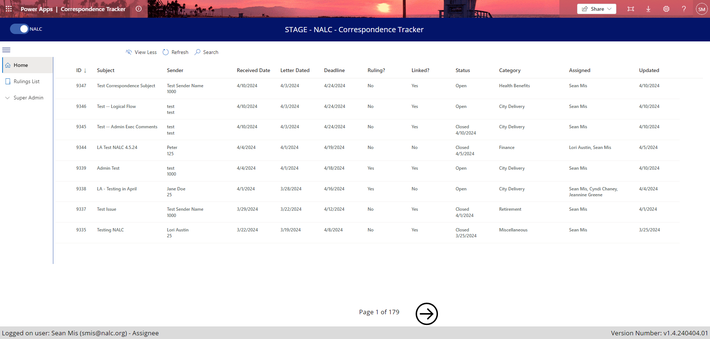</kbd>

To begin, double click on the row of the Correspondence that you would like to review

NOTE: You can limit the display of Correspondences in your main list by clicking on the "View Less" button at the top, just below the banner -- additionally, you can search for the Correspondence that you'd like to edit by typing in the ID in the search bar, or you can search by Category, Subject, etc.

### Review Correspondence Details
<kbd></kbd>

Here on the Details page, you can review all the fields: Subject, Category, Type, Received Date, Letter Dated, Deadline, Issue, and other Assignees, if applicable

To process your Correspondence, the first of two required steps is to select a Sent Date -- the second is to upload an attachment

<kbd>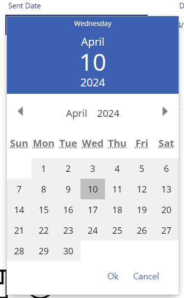</kbd>

You can select a Sent Date by clicking in the date box and selecting a date from the date-picker -- click OK to continue

### Review Sender Information
<kbd>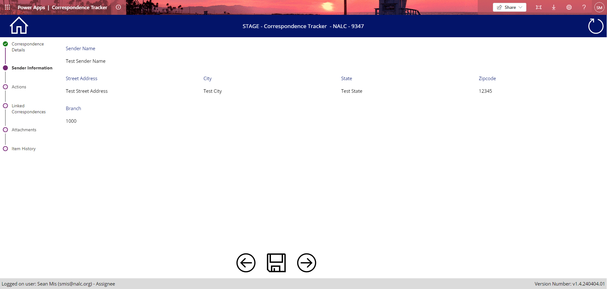</kbd>

Here on the Sender Information page, you can review all the fields to check for accuracy: Sender Name, Street Address, City, State, Zipcode, and Branch

Click the right arrow to proceed to the Actions

### Review Correspondence Actions
<kbd>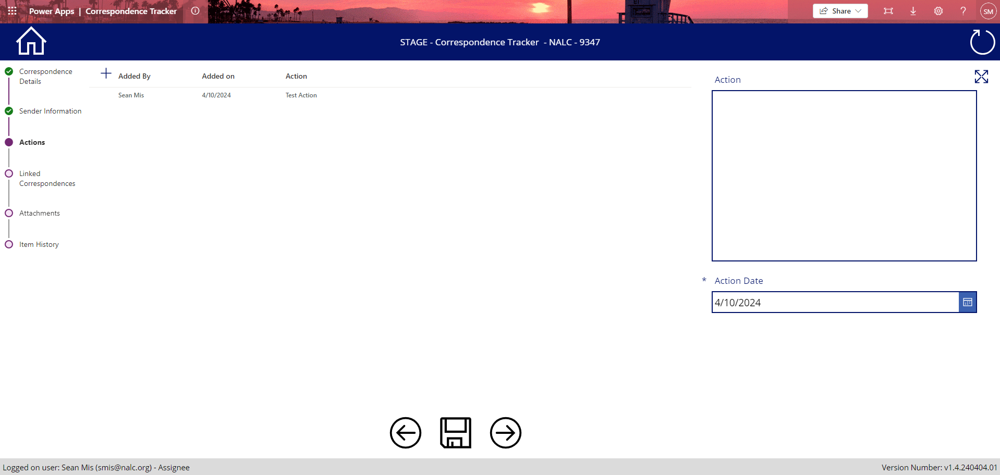</kbd>

Here on the Actions page, you can review any previously added Actions and their added dates

Click the right arrow to proceed to Linked Correspondences

### Review Linked Correspondence
<kbd>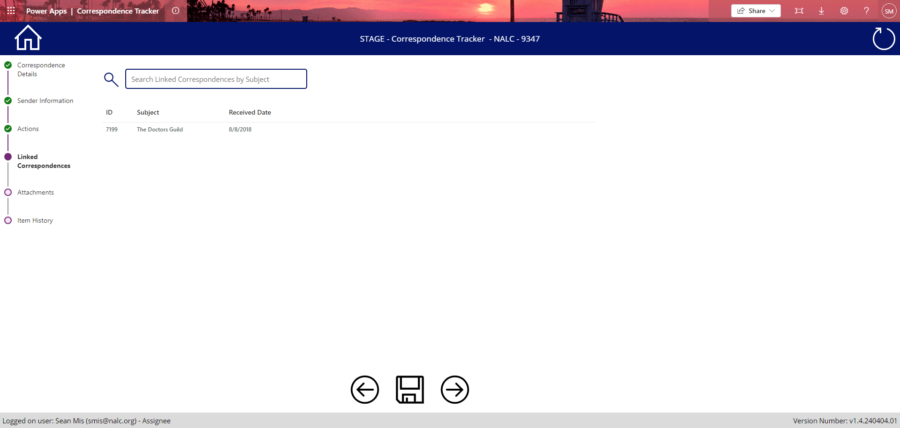</kbd>

Here on the Linked Correspondences page, you can review any previously linked Correspondences and their linked dates

Click the right arrow to proceed to Attachments

### Review Correspondence Attachments
<kbd>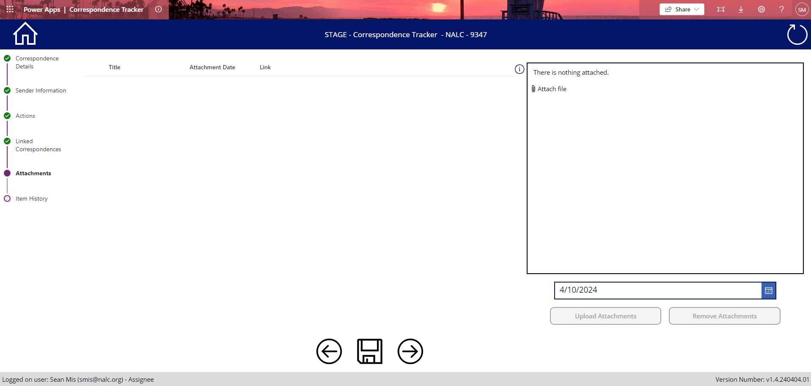</kbd>

Here on the Attachments page, you must add an attachment before you can send this Correspondence to the Executive -- to do so, click "Attach file" on the right side of the screen

<kbd>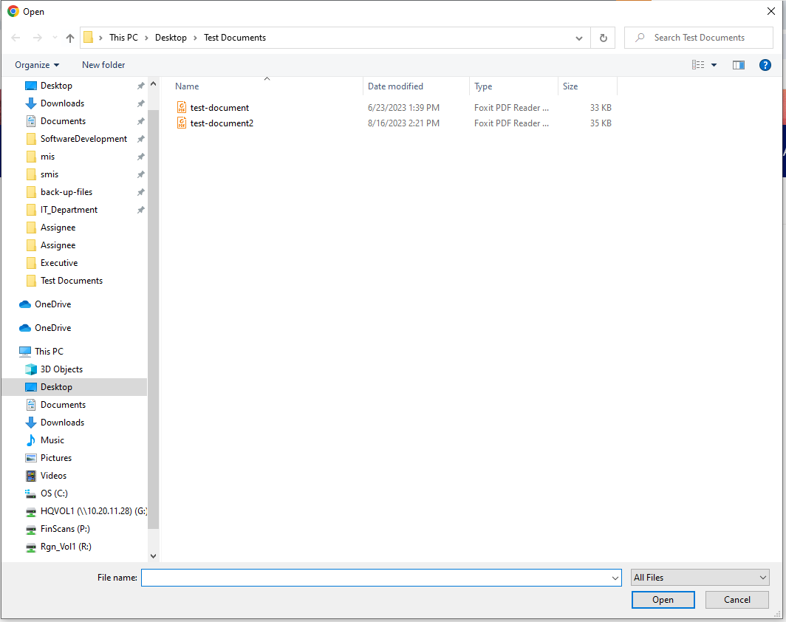</kbd>

You can now see the file explorer of your local PC -- click on the file of your choice that you would like to attach to this Correspondence, and click the Open button to attach this file

Next, you must select the date that you would like to associate with this attachment -- after you've selected a date, you can click the Upload Attachments button, or you can remove the attachment by clicking the Remove Attachments button if you've made a mistake

<kbd>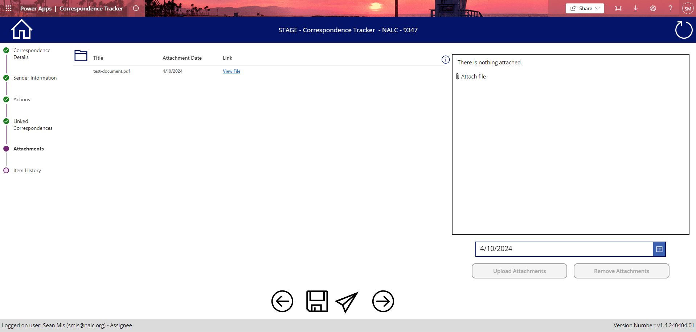</kbd>

You can now see your attachment for your Correspondence, and, if necessary, you can repeat the above steps to attach another document -- otherwise, click the Right arrow to proceed to Item History

### Review Correspondence Item History
<kbd>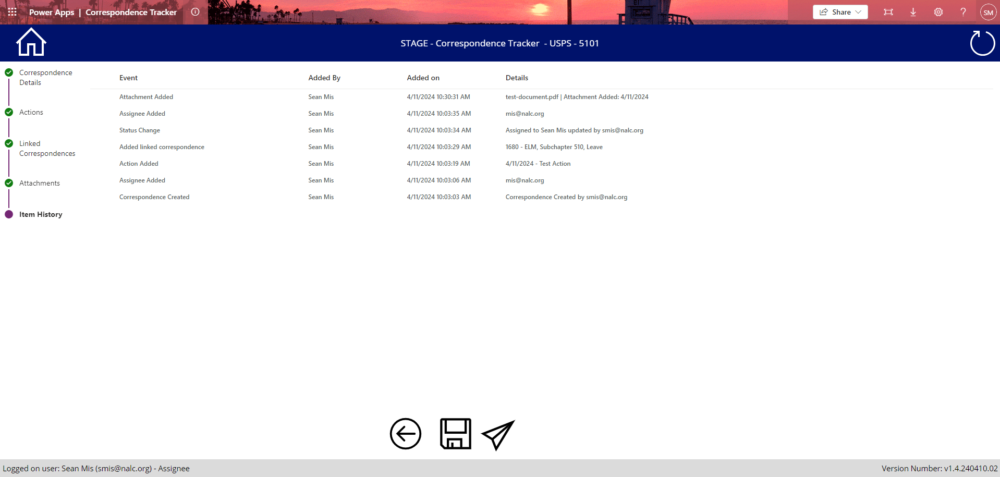</kbd>

Here on the Item History page, you can review all of the actions that have occurred for this Correspondence -- be sure to review that your Attachment history is visible in the list before submitting your Correspondence

<kbd>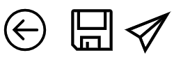</kbd>

To send your assigned Correspondence to the Executive, click the Airplane icon at the bottom of the page

## NALC Correspondence -- Assignee (Returned from Executive)
### Select Correspondence to Review
<kbd></kbd>

To begin, find the Correspondence that was returned to you from the Executive as the Assignee -- you should have received an email notification alerting you about the Correspondence being returned to you

Double click on the row of the Correspondence that you would like to review

### View Executive Comments
<kbd>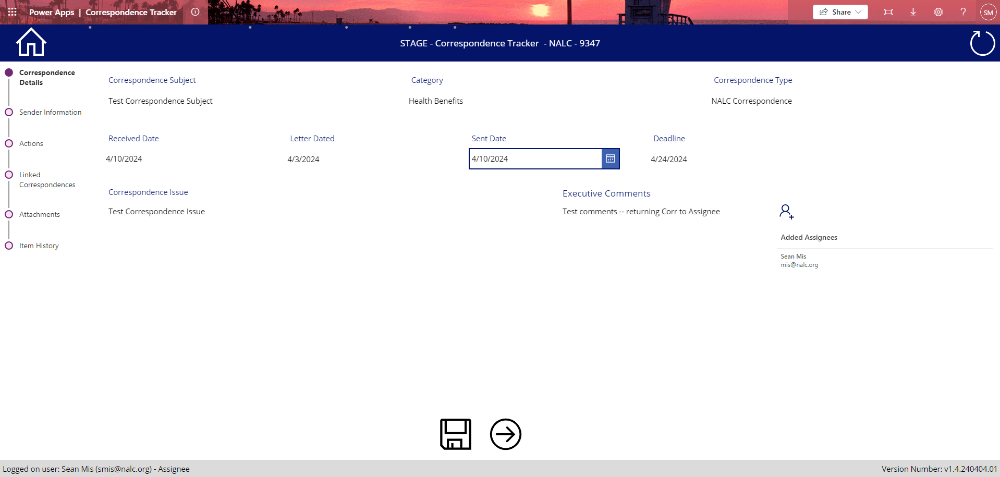</kbd>

Here you can see the Correspondence Details, as well as the Executive comments -- these comments should include instructions about why this Correspondence has been returned to you

You can skip to the Attachments page to upload your response to the Executive by clicking on the Attachments link on the left side of the page

### Upload Response Attachment(s)
<kbd>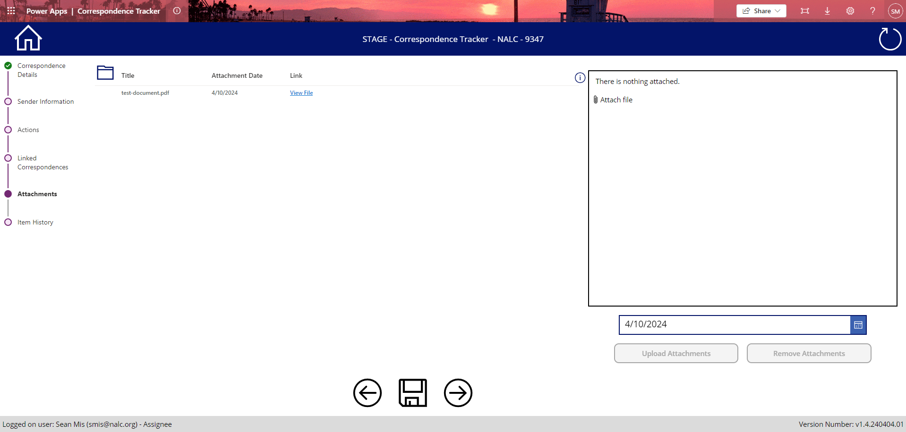</kbd>

On the Attachments page, you can see your previously uploaded attachments

To respond to the Executive's feedback, you can attach a new file by clicking on "Attach file" on the right side of the screen

<kbd></kbd>

You can now see the file explorer of your local PC -- click on the file of your choice that you would like to attach to this Correspondence, and click the Open button to attach this file

Next, you must select the date that you would like to associate with this attachment -- after you've selected a date, you can click the Upload Attachments button, or you can remove the attachment by clicking the Remove Attachments button if you've made a mistake

### Review Item History
<kbd>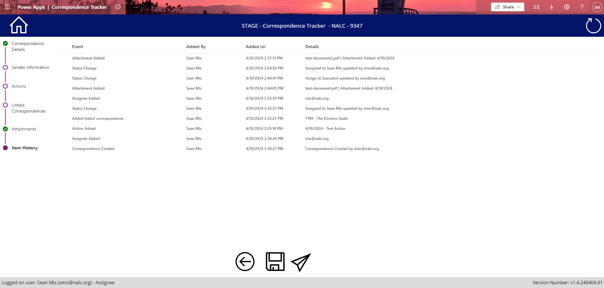</kbd>

You can click the airplane icon at the bottom of the page to return this Correspondence to the Executive for final processing

## NALC Correspondence -- Executive
### Select Correspondence to Review
<kbd>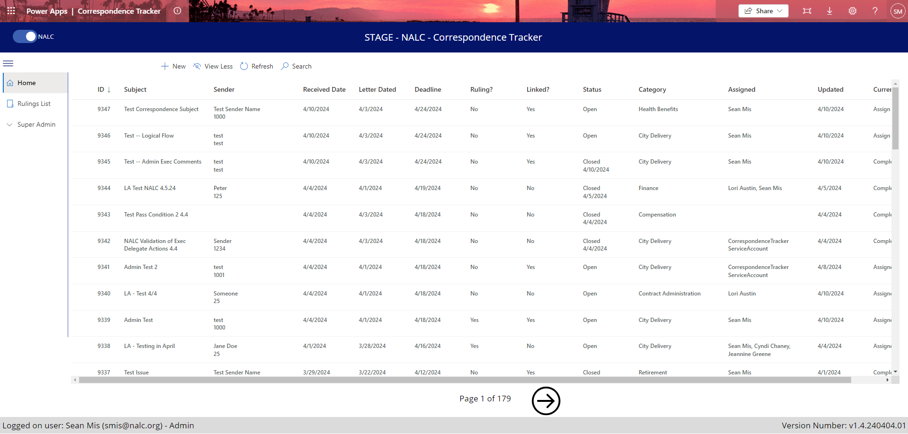</kbd>

To begin, find the Correspondence that was sent to you as the Executive

Double click on the row of the Correspondence that you would like to review

### Review Correspondence Details
<kbd></kbd>

Here you can see the Correspondence Details form page, with text boxes for Subject and Issue, a dropdown for Category, and date pickers for Received, Letter Dated, and Deadline dates

You can also see the Executive Comments box -- here, you can enter feedback and instructions if you would like to return this Correspondence to the Assignee for further processing -- you can return to this screen at a later time to enter comments, if necessary

To further review this Correspondence, click the right arrow to progress to Sender Information

### Review Sender Information
<kbd>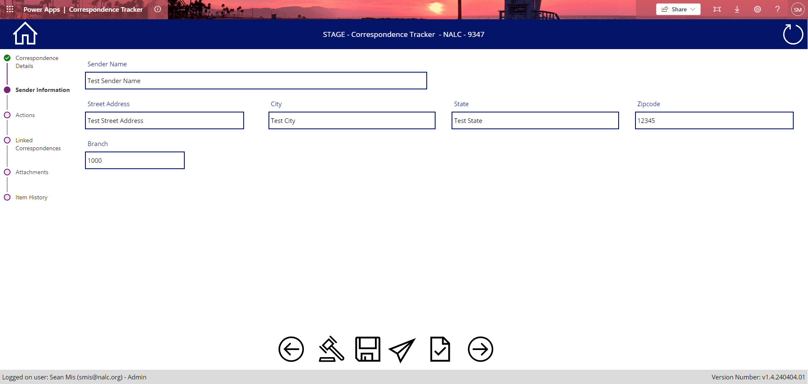</kbd>

Here you can see the fields for the Sender: Sender Name, Street Address, City, State, Zipcode, and Branch

Click the right arrow to progress to Actions

### Review Correspondence Actions
<kbd>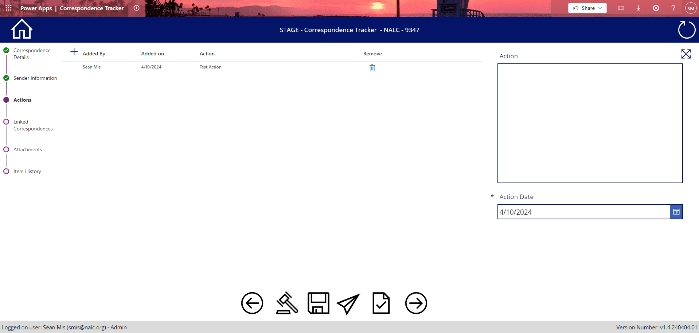</kbd>

Here you can see the Actions that were previously added

Click the right arrow to progress to Linked Correspondences

### Review Linked Correspondence
<kbd>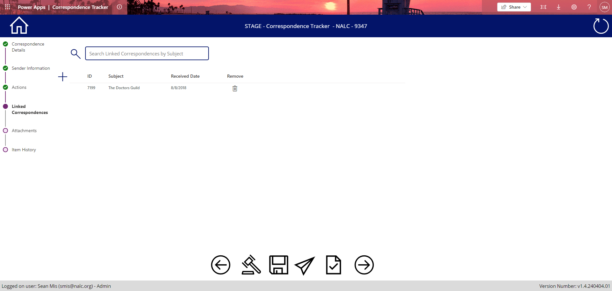</kbd>

Here you can see any previously linked Correspondences

Click the right arrow to progress to Attachments

### Review Attachments
<kbd>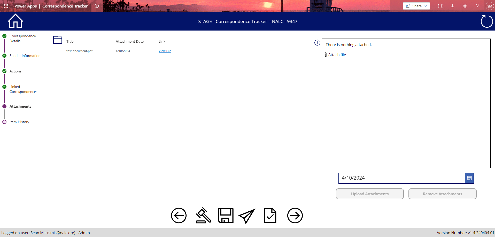</kbd>

Here you can see any previously added Attachments

Click the right arrow to progress to Item History

### Review Item History
<kbd>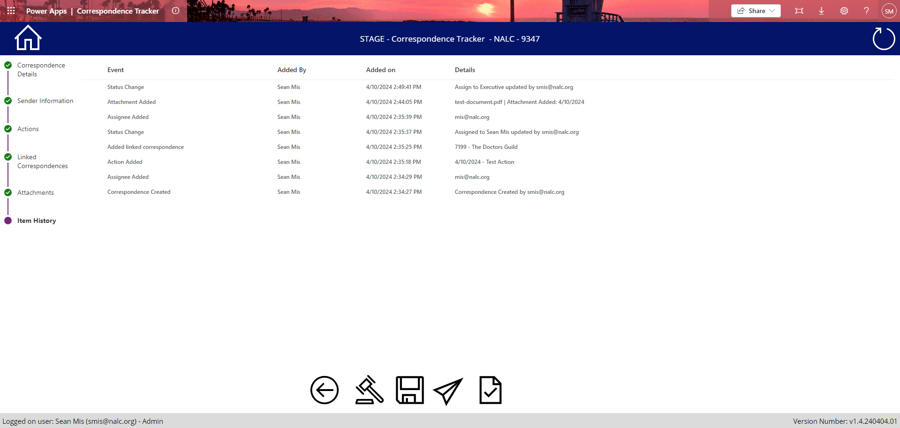</kbd>

Here you can see all events associated with this Correspondence in Item History

<kbd></kbd>

After reviewing the entire Correspondence, you can either: click the icon with the checked document to complete this Correspondence; or you can return this Correspondence to the Assignee by navigating back to the Correspondence Details page and entering instructions in the Executive Comments textbox

<kbd></kbd>

Click the airplane icon to send this Correspondence back to the Assignee for further processing

## NALC Correspondence -- Executive (Returned from Assignee)
### Select Correspondence to Review
<kbd></kbd>

To begin, find the Correspondence that was returned to you from the Assignee, and double click on it to review the most recent changes

### Review Correspondence Details
<kbd>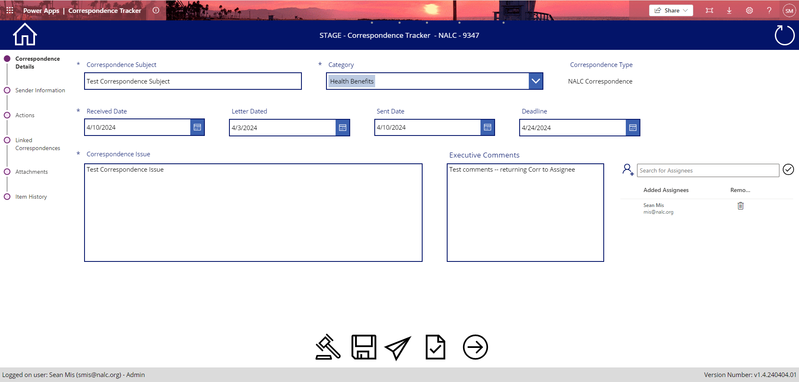</kbd>

Here you can review all Correspondence Details, including your previously entered Executive Comments

You can skip to where the Assignee has responded to your comments by navigating to the Attachments section found on the left side of the page

### Review Attachments
<kbd>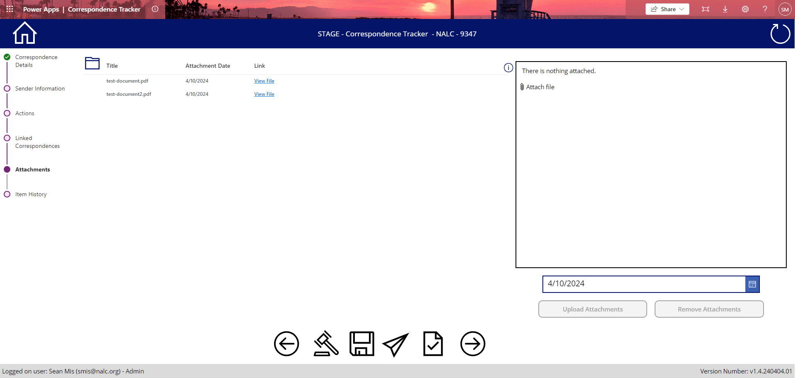</kbd>

Here you can review all attachments associated with this Correspondence, including the most recent addition, sent from the Assignee in response to this returned Correspondence

To view the most recent attachment, find the most recent Attachment Date, and click on the View File link to view the attachment for further evaluation

Click the right arrow to progress to Item History

<kbd>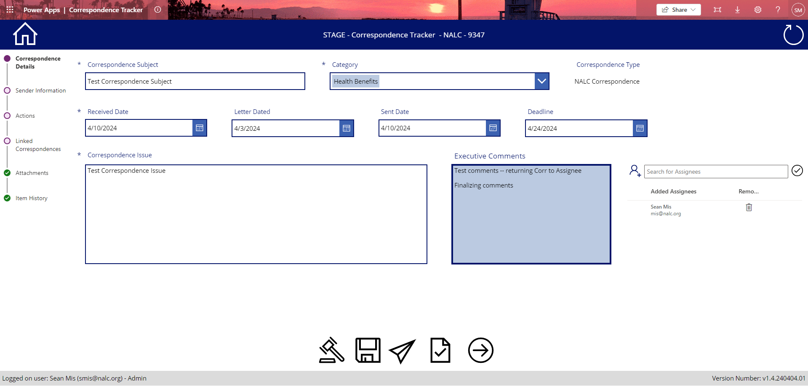</kbd>

You can navigate back to the Correspondence details page and enter a final Executive comment that communicates that the prior issue is resolved and this Correspondence is now closed

You can click the document icon with the checkmark to finish and finalize this Correspondence

<kbd>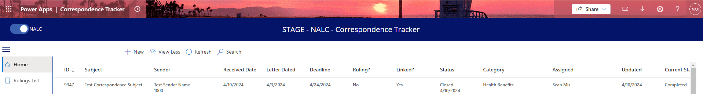</kbd>

Back on the main screen, you can see your finalized Correspondence, with a Status of Closed with a closed date

## New USPS Correspondence
### Create New Correspondence
<kbd>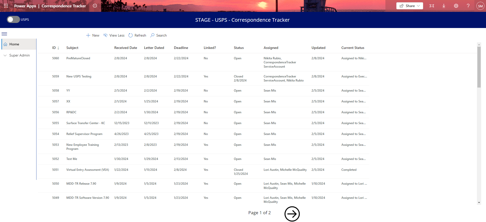</kbd>

To begin, click on the "+ New" button

### Enter Correspondence Details
<kbd>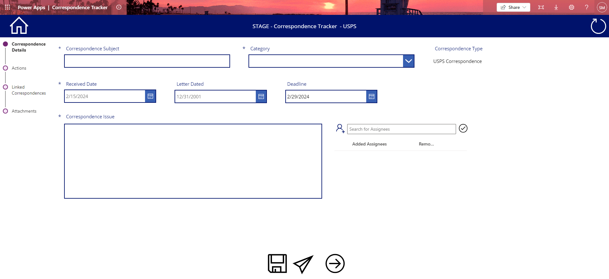</kbd>

Here you can see the Correspondence Details form page, with text boxes for Subject and Issue, a dropdown for Category, and date pickers for Received, Letter Dated, and Deadline dates

### Select Assignee(s)
<kbd>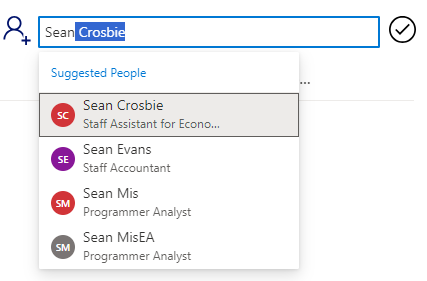</kbd> 

There is also a picker for Assignees -- you can begin typing the name of the Assignee and their name will appear -- select their name to assign them to this Correspondence, and add as many Assignees as necessary

NOTE: Be sure to click the checkbox, as this is how to add an Assignee to your new Correspondence -- failing to do so will create a Correspondence without an attached Assignee

<kbd>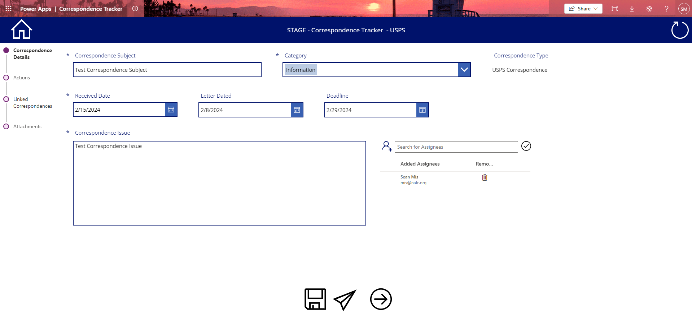</kbd>

After entering all of your text and selecting the Category, dates, and Assignee, you can click on the right arrow (or click on Sender Information on the left side) to progress to Sender Information 

NOTE: a new USPS Correspondence ID will be created once you click the next arrow or on Sender Information -- until this point, an ID has not been created and your text and selections have not been saved, but your text and selections in Correspondence Details will be saved when you progress to Sender Information

### Actions
<kbd>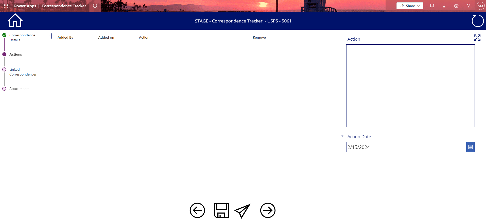</kbd>

Here you can see the page for adding and maintaining Actions

<kbd>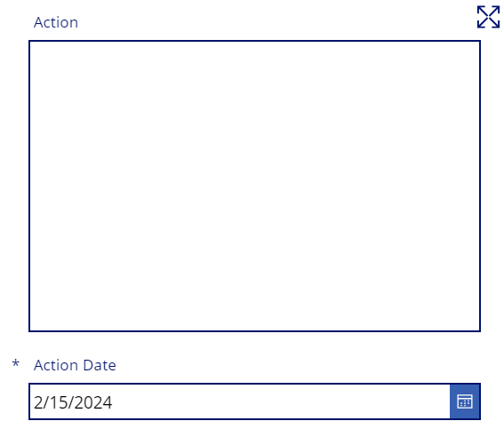</kbd> 

To begin, enter your Action details in the large text box -- click the expand button in the top right corner to see your Action in an expanded view, if necessary -- and select your Action Date from the date picker, then click Add Action to insert your Action in the Action list on the left side of the page

<kbd>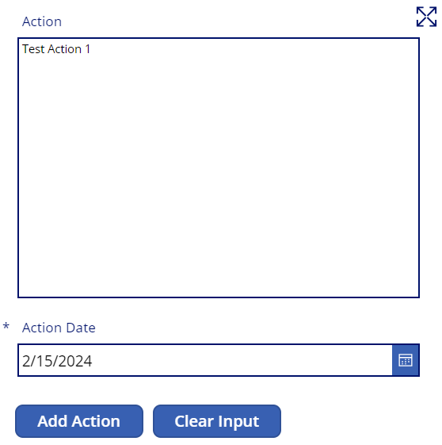</kbd>

Here you can see your Action, with the creator of the Action, date the Action was added, Action details -- you can click on the Remove icon to permanently delete this Action

<kbd>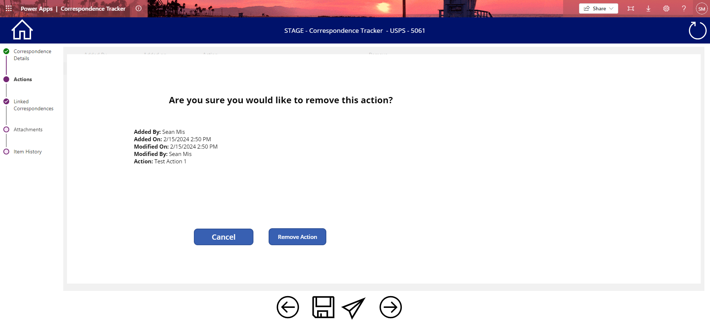</kbd>

If you clicked on the Remove icon you will see this pop-up confirmation screen -- click Remove Action to permanently delete this Action

<kbd>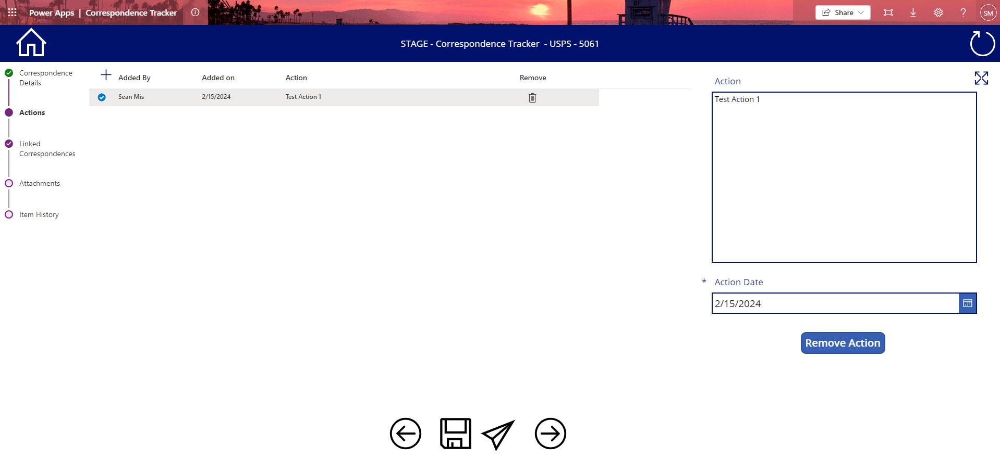</kbd>

Click on the next arrow (or click on Linked Correspondences) to progress to Linked Correspondences

### Linked Correspondences
<kbd>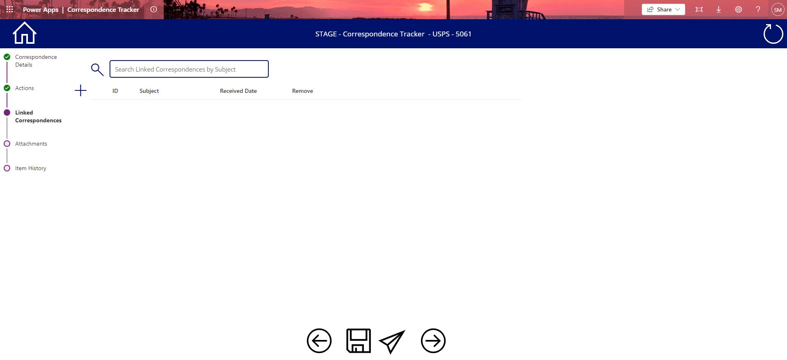</kbd>

Here you can see the page for adding Linked Correspondences to your new Correspondence -- click the plus "+" icon to add a new Linked Correspondence

<kbd>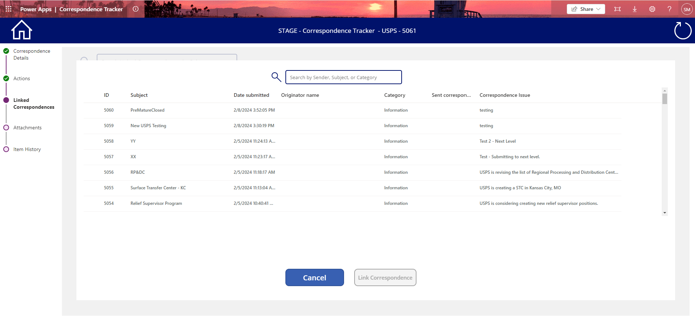</kbd>

Here you can see the list of all Correspondences available to be linked -- double-click on the Correspondence of your choice to link it to your new Correspondence -- you can search for any Correspondence by beginning to type in any details of the Correspondence that you're looking for: Sender Name, Subject, or Category

<kbd>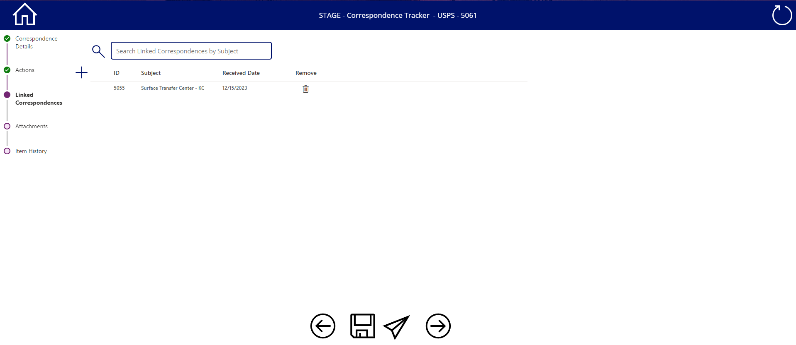</kbd>

Here you can see the Correspondence that you selected and that is now linked to your new Correspondence

<kbd>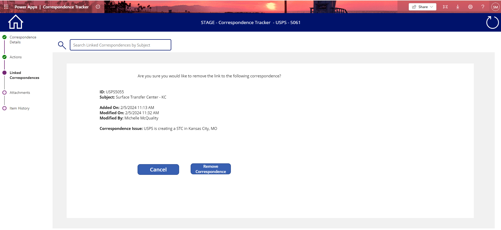</kbd>

To delete a linked Correspondence, click the Remove icon, and you will see this pop-up confirmation screen -- click Remove Correspondence to permanently delete this link to another Correspondence

### Attachments
<kbd>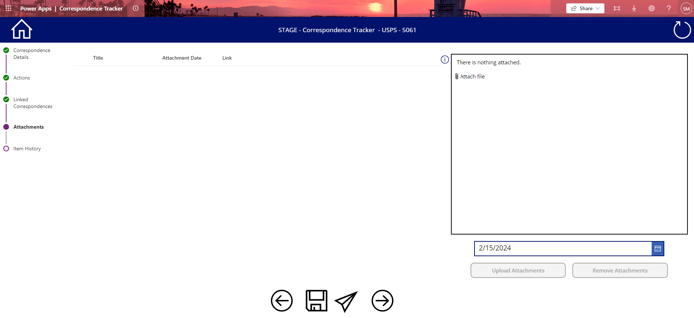</kbd>

Here you can see the page for adding Attachments to your new Correspondence -- click the paperclip/Attach file to attach Word or PDF files

<kbd>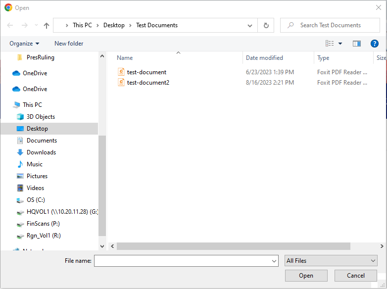</kbd>

Here you can see Windows Explorer window that allows you to navigate to the file of your choice on your local PC -- click OK when you've located and selected the file

<kbd>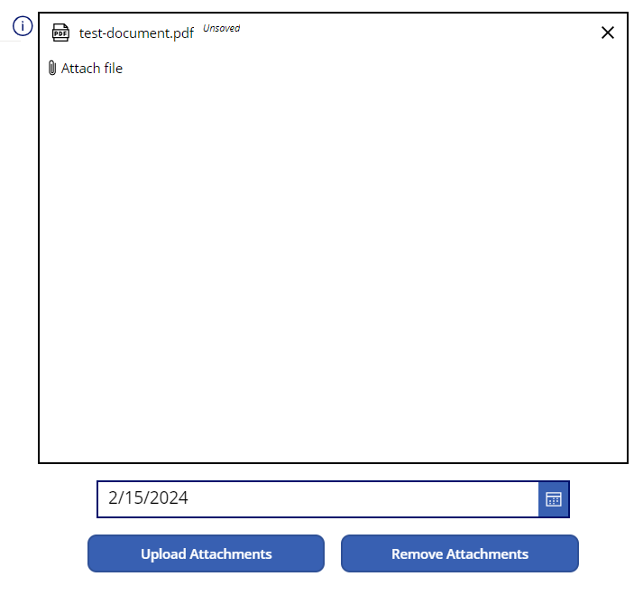</kbd>

Now you can see the file name, with the text "Unsaved" -- add any additional attachments necessary for this new Correspondence

<kbd></kbd> 

To select a date to be associated with your uploaded Attachment(s) click on the date picker and select a date of your choice

<kbd>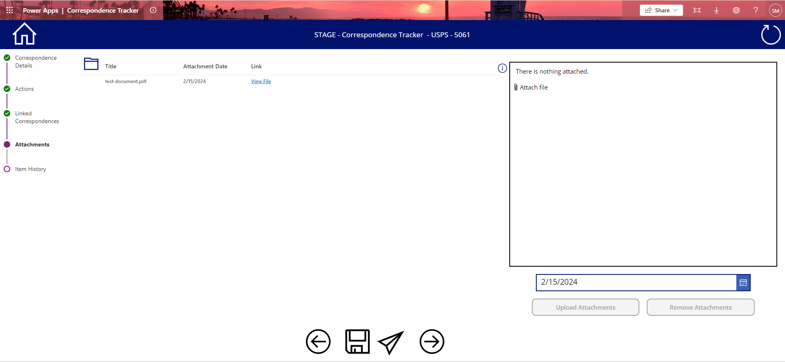</kbd>

After selecting a date and then clicking the Upload Attachments button, you can now see your attachments in the list on the left side of the page

<kbd>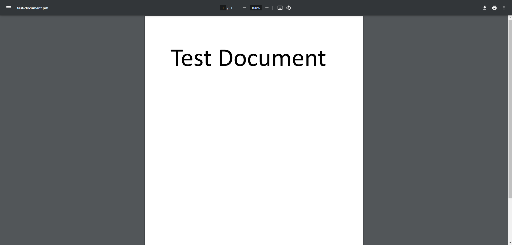</kbd>

You can click on the View File link to view the uploaded file -- a new browser tab will open and your document will appear

<kbd>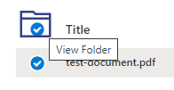</kbd>

To view your upload in SharePoint, you can click on the blue folder icon in the top left corner (near the Title and Attachment Date of your attachment)

<kbd>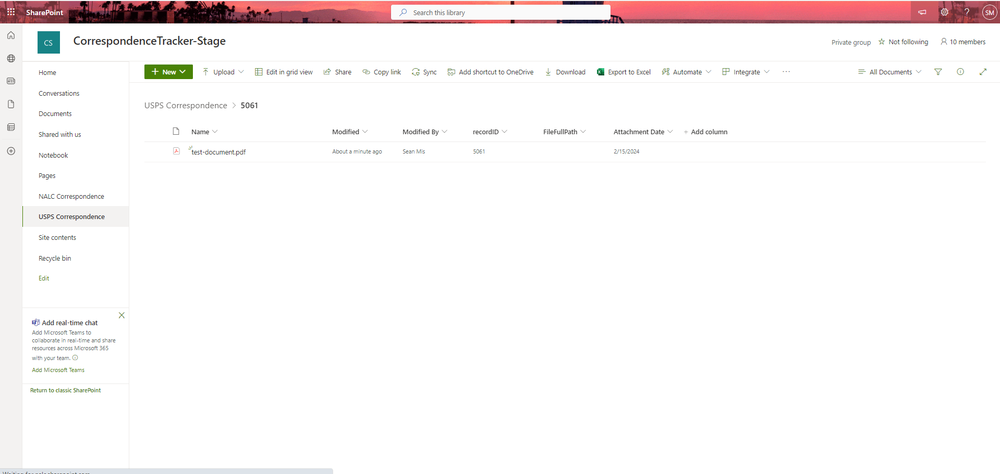</kbd>

Here you can view all uploaded files in SharePoint associated with this Correspondence, and you can also delete files in this location

### Item History
<kbd>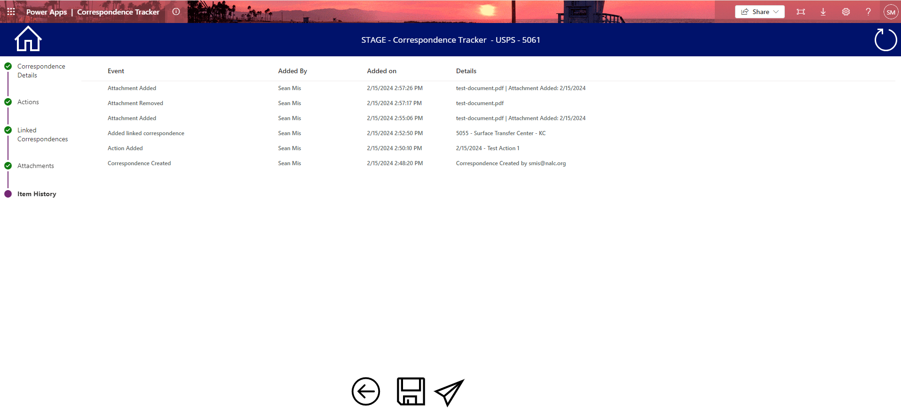</kbd>

Here you can see all the events in the Item History -- every executable action during the creation of your new Correspondence can be seen here

## Edit USPS Correspondence
### Select Correspondence to Edit
<kbd></kbd>

To begin, double click on the row of the Correspondence that you would like to edit

NOTE: You can search for the Correspondence that you'd like to edit by typing in the ID in the search bar, or you can search by Category, Subject, etc.

### Edit Correspondence Details
<kbd>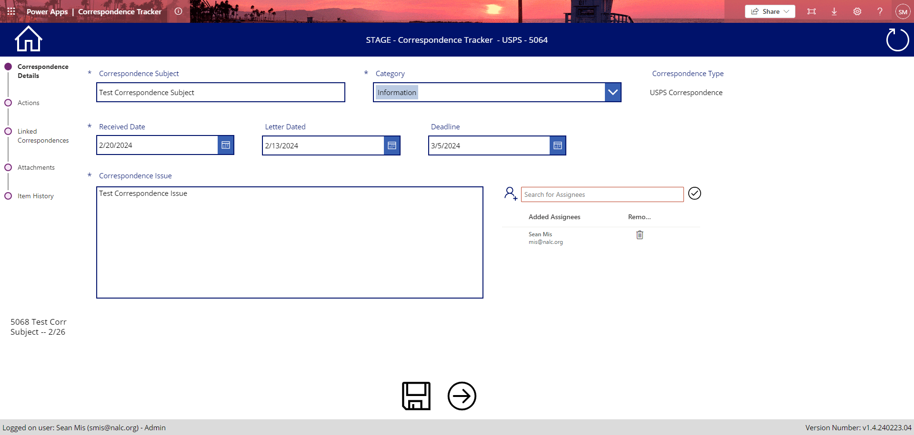</kbd>

Here you can see all the fields populated with data for the Correspondence that you're editing -- begin typing in the Subject or Issue text boxes to update the data, select a new Category from the drop-down, change the dates from the date pickers, or search for and add a new Assignee -- click the next arrow to save and continue editing, or the "Disk" icon to save and exit

### Edit Actions
<kbd>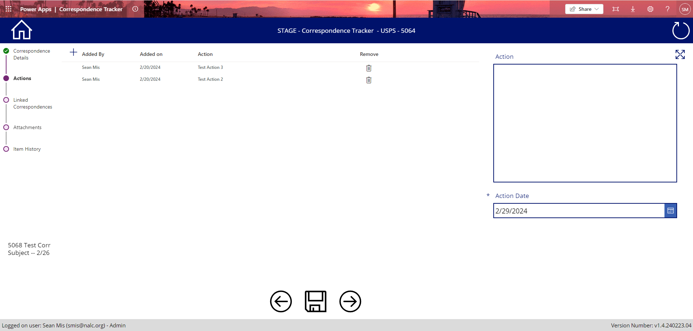</kbd>

Here you can see any Actions that were created for this Correspondence -- you can click on the Action and view its details on the right side (where you can update the details or the Action date), you can add a new Action by clicking on the '+' icon in the top right, or you can delete an Action by clicking the remove icon

### Edit Linked Correspondences
<kbd></kbd>

Here you can see all of any Correspondences that are linked to the Correspondence that you are editing -- to remove a linked Correspondence, click the remove icon, and to link another Correspondence, click the '+' icon at the top right, and select the Correspondence of your choice  -- you can search for any Correspondence by beginning to type in any details of the Correspondence that you're looking for: Sender Name, Subject, or Category

### Edit Attachments
<kbd>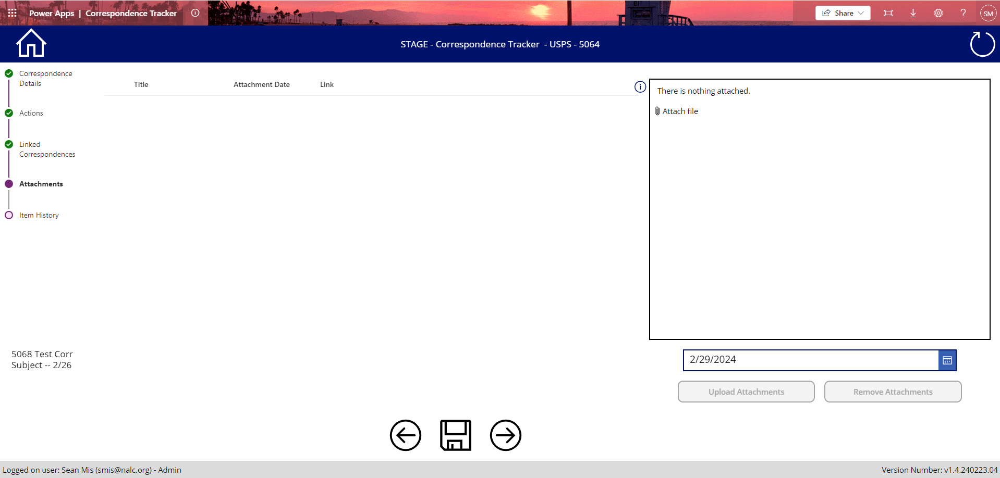</kbd>

Here you can see any files that were attached to this Correspondence -- you can remove an attachment by selecting it and then clicking the Remove Attachments button on the bottom right side -- you can add a new Attachment by clicking on Attach file and browsing your local PC for the file of your choice

### Item History Edits
<kbd>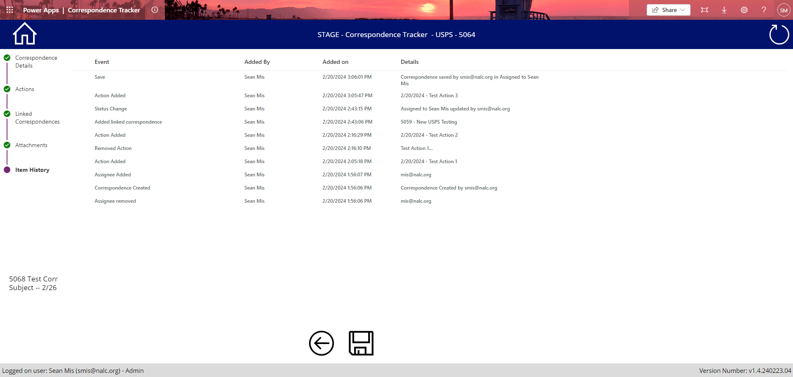</kbd>

Here you can view the item history as well as any additional edits made to this Correspondence

## USPS Correspondence -- Assignee
### Select Correspondence to Review
<kbd></kbd>

To begin, double click on the row of the Correspondence that you would like to review

NOTE: You can limit the display of Correspondences in your main list by clicking on the "View Less" button at the top, just below the banner -- additionally, you can search for the Correspondence that you'd like to edit by typing in the ID in the search bar, or you can search by Category, Subject, etc.

### Review Correspondence Details
<kbd>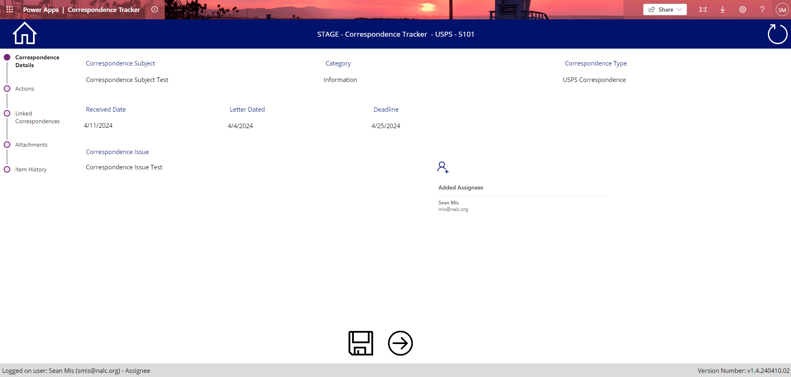</kbd>

Here on the Details page, you can review all the fields: Subject, Category, Type, Received Date, Letter Dated, Deadline, Issue, and other Assignees, if applicable

Click the right arrow to proceed to Actions

### Review Correspondence Actions
<kbd></kbd>

Here on the Actions page, you can review any previously added Actions and their added dates

Click the right arrow to proceed to Linked Correspondences

### Review Linked Correspondence
<kbd>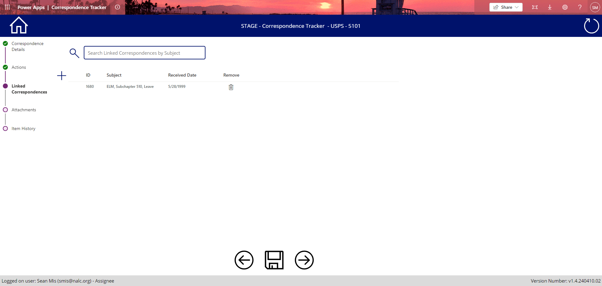</kbd>

Here on the Linked Correspondences page, you can review any previously linked Correspondences and their linked dates

Click the right arrow to proceed to Attachments

### Review Correspondence Attachments
<kbd>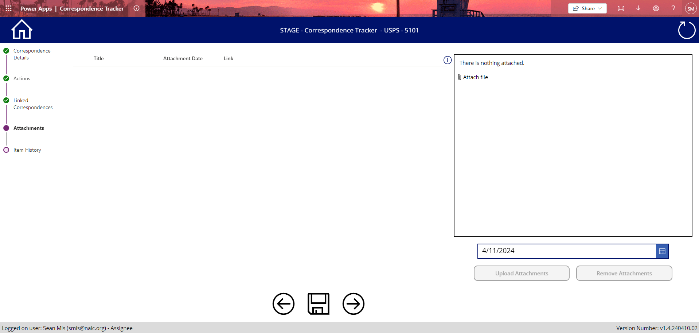</kbd>

Here on the Attachments page, you must add an attachment before you can send this Correspondence to the Executive -- to do so, click "Attach file" on the right side of the screen

<kbd></kbd>

You can now see the file explorer of your local PC -- click on the file of your choice that you would like to attach to this Correspondence, and click the Open button to attach this file

Next, you must select the date that you would like to associate with this attachment -- after you've selected a date, you can click the Upload Attachments button, or you can remove the attachment by clicking the Remove Attachments button if you've made a mistake

<kbd>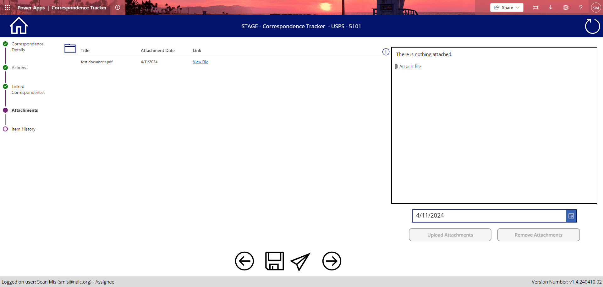</kbd>

You can now see your attachment for your Correspondence, and, if necessary, you can repeat the above steps to attach another document -- otherwise, click the Right arrow to proceed to Item History

### Review Correspondence Item History
<kbd></kbd>

Here on the Item History page, you can review all of the actions that have occurred for this Correspondence -- be sure to review that your Attachment history is visible in the list before submitting your Correspondence

<kbd></kbd>

To send your assigned Correspondence to the Executive, click the Airplane icon at the bottom of the page

## USPS Correspondence -- Assignee (Returned from Executive)
### Select Correspondence to Review
<kbd>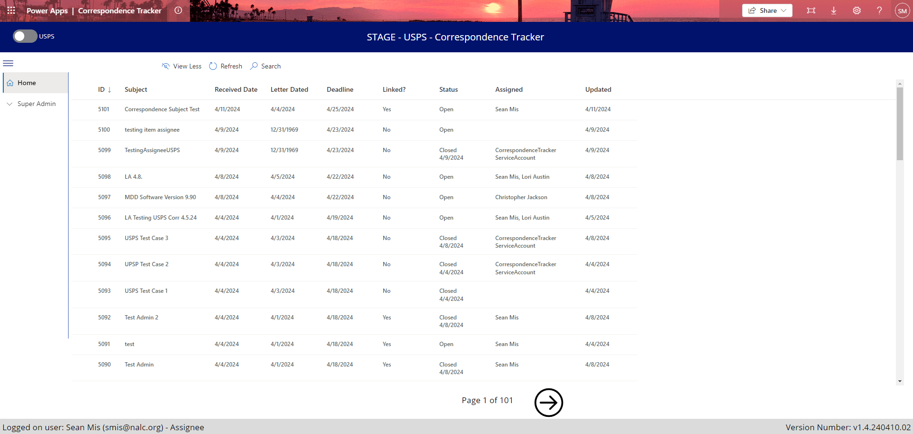</kbd>

To begin, find the Correspondence that was returned to you from the Executive as the Assignee -- you should have received an email notification alerting you about the Correspondence being returned to you

Double click on the row of the Correspondence that you would like to review

### View Executive Comments
<kbd>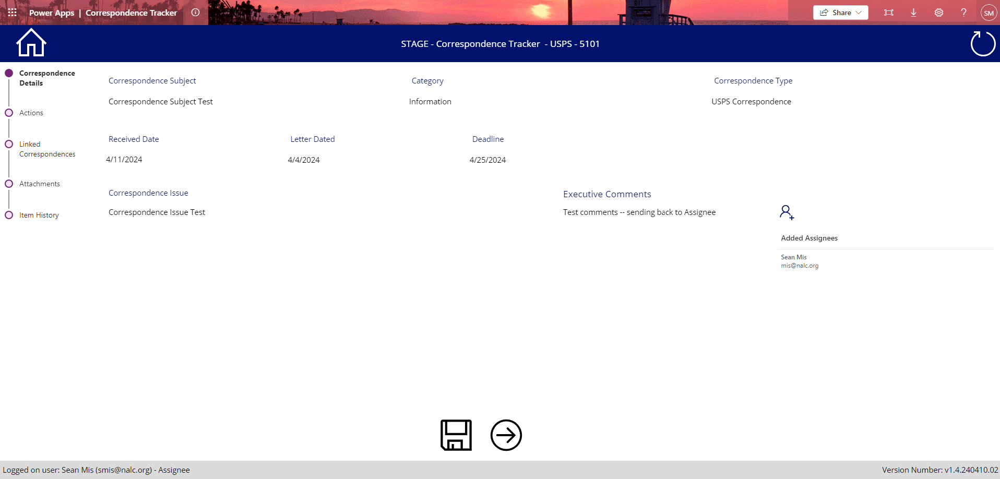</kbd>

Here you can see the Correspondence Details, as well as the Executive comments -- these comments should include instructions about why this Correspondence has been returned to you

You can skip to the Attachments page to upload your response to the Executive by clicking on the Attachments link on the far left side of the page

### Upload Response Attachment(s)
<kbd>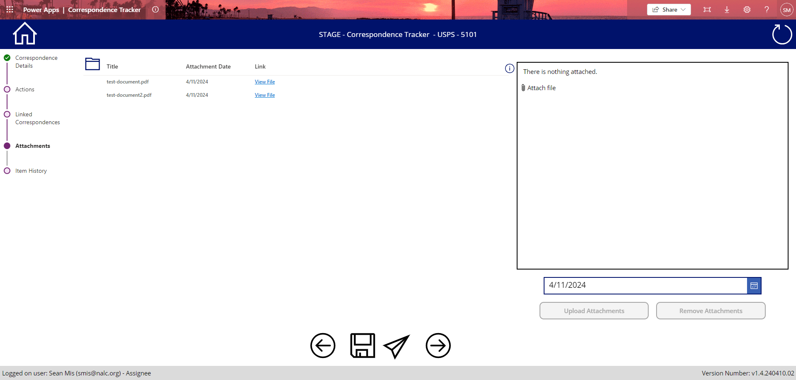</kbd>

On the Attachments page, you can see your previously uploaded attachments

To respond to the Executive's feedback, you can attach a new file by clicking on "Attach file" on the right side of the screen

<kbd></kbd>

You can now see the file explorer of your local PC -- click on the file of your choice that you would like to attach to this Correspondence, and click the Open button to attach this file

Next, you must select the date that you would like to associate with this attachment -- after you've selected a date, you can click the Upload Attachments button, or you can remove the attachment by clicking the Remove Attachments button if you've made a mistake

<!-- ### Review Item History
<kbd></kbd>

On the Item History page, you can see your previous events, including the Attachment that was just added as a response to the Executive's comments

Ensure that your event is visible at the top of the list, and once this is confirmed, you can click the airplane icon at the bottom of the page to return this Correspondence to the Executive for final processing -->

## USPS Correspondence -- Executive
### Select Correspondence to Review
<kbd>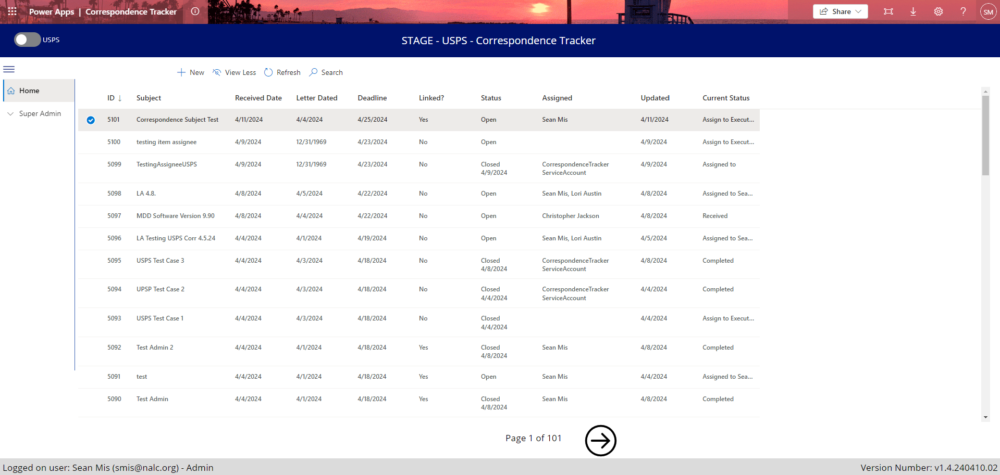</kbd>

To begin, find the Correspondence that was sent to you as the Executive

Double click on the row of the Correspondence that you would like to review

### Review Correspondence Details
<kbd>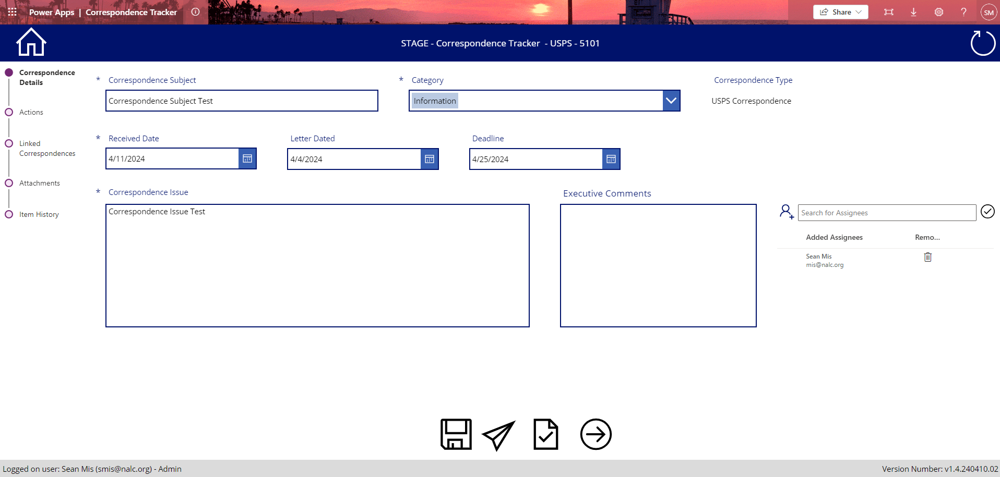</kbd>

Here you can see the Correspondence Details form page, with text boxes for Subject and Issue, a dropdown for Category, and date pickers for Received, Letter Dated, and Deadline dates

You can also see the Executive Comments box -- here, you can enter feedback and instructions if you would like to return this Correspondence to the Assignee for further processing -- you can return to this screen at a later time to enter comments, if necessary

To further review this Correspondence, click the right arrow to progress to Actions

### Review Correspondence Actions
<kbd>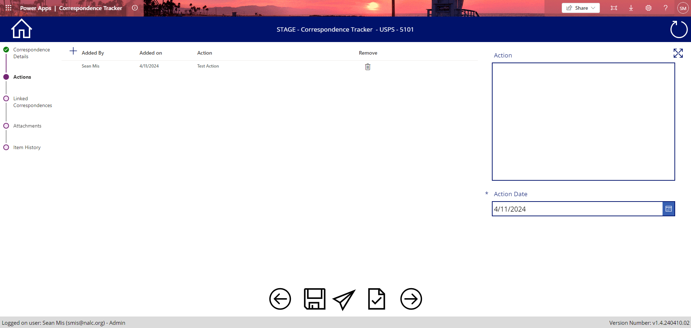</kbd>

Here you can see the Actions that were previously added

Click the right arrow to progress to Linked Correspondences

### Review Linked Correspondence
<kbd>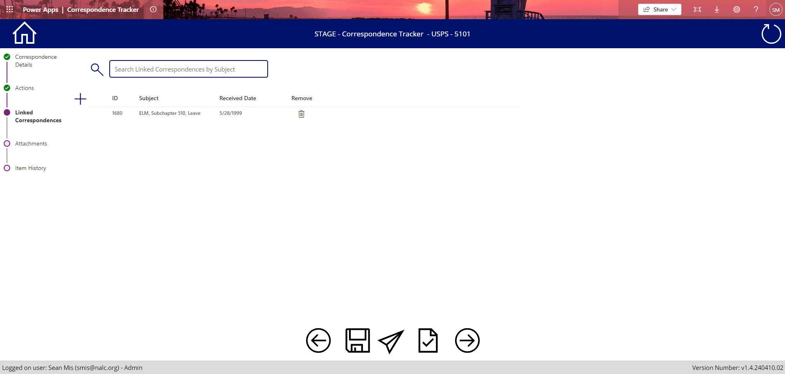</kbd>

Here you can see any previously linked Correspondences

Click the right arrow to progress to Attachments

### Review Attachments
<kbd>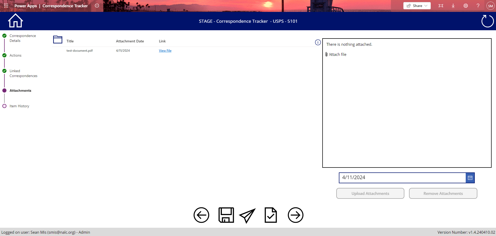</kbd>

Here you can see any previously added Attachments

Click the right arrow to progress to Item History

### Review Item History
<kbd>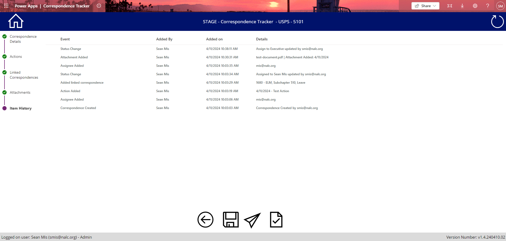</kbd>

Here you can see all events associated with this Correspondence in Item History

<kbd>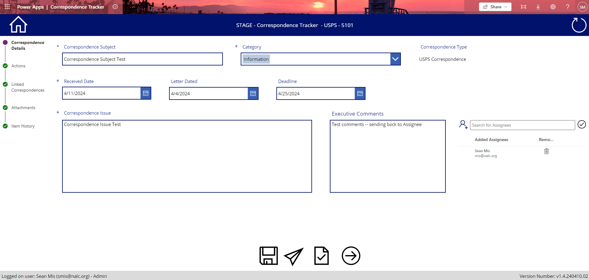</kbd>

After reviewing the entire Correspondence, you can either: click the icon with the checked document to complete this Correspondence; or you can return this Correspondence to the Assignee by navigating back to the Correspondence Details page and entering instructions in the Executive Comments textbox -- click the airplane icon to send this Correspondence back to the Assignee for further processing

<kbd></kbd>

## USPS Correspondence -- Executive (Returned from Assignee)
### Select Correspondence to Review
<kbd>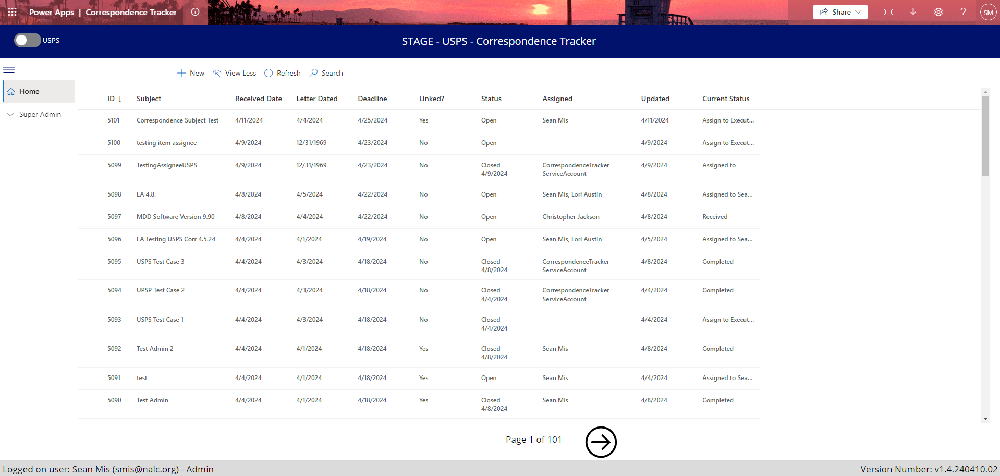</kbd>

To begin, find the Correspondence that was returned to you from the Assignee, and double click on it to review the most recent changes

### Review Correspondence Details
<kbd>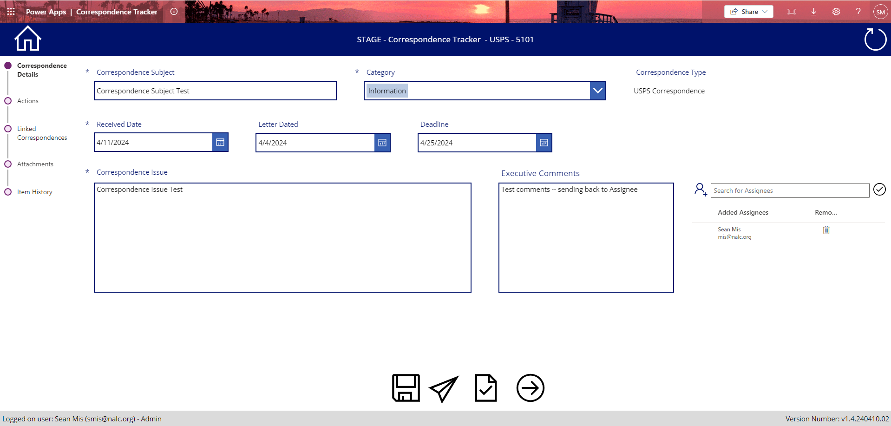</kbd>

Here you can review all Correspondence Details, including your previously entered Executive Comments

Click the right arrow to progress to Actions

<!-- ### Review Correspondence Actions
<kbd>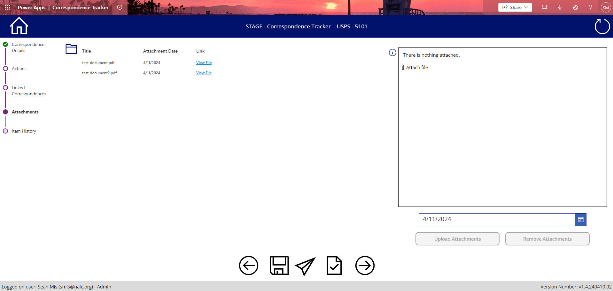</kbd>

Here you can review all Correspondence Actions

Click the right arrow to progress to Linked Correspondences

### Review Linked Correspondences
<kbd>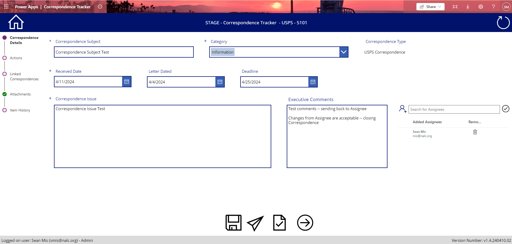</kbd>

Here you can review all Linked Correspondences

Click the right arrow to progress to Attachments -->

### Review Attachments
<kbd></kbd>

Here you can review all attachments associated with this Correspondence, including the most recent addition, sent from the Assignee in response to this returned Correspondence

To view the most recent attachment, find the most recent Attachment Date, and click on the View File link to view the attachment for further evaluation

Click the right arrow to progress to Item History

<!-- ### Review Item History
<kbd>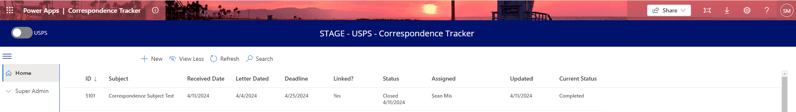</kbd>

Here you can review all events associated with this Correspondence

If you are satisfied with all changes, you can navigate back to the Details page by clicking on the Correspondence Details link on the left side of the page -->

<kbd></kbd>

Here you can enter a final comment that will close this Correspondence

<kbd>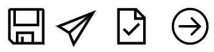</kbd>

You can now click the page icon with the checkmark to complete and finalize this Correspondence

<kbd></kbd>

Back on the main screen, you can see your close and finalized Correspondence, with a Status of Close with a closed date

## Search for USPS/NALC Officer Correspondence Documents on SharePoint
### Search for Correspondence

<kbd>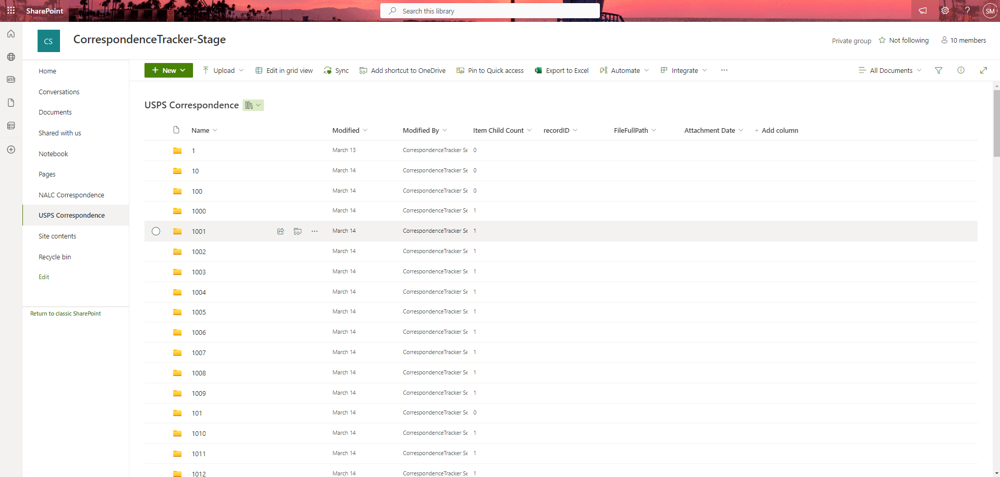</kbd>

To begin, you can search for a Correspondence of your choice by using the Search bar at the top of the page and typing in the ID of your choice and pressing Enter

### View Search Results

<kbd>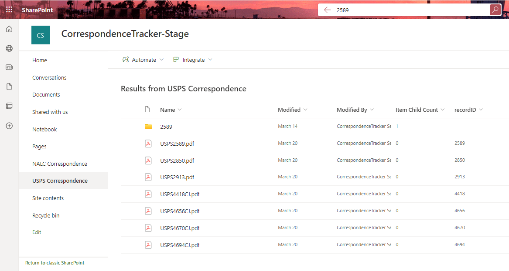</kbd>

Here you can see all of the results of your search -- you can see the folder of the ID that you searched for, as well as specific documents with the value of the ID you search for

### View Search Results

<kbd>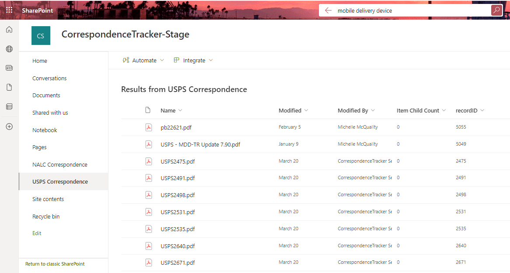</kbd>

You can also search for specific phrases in the Search bar, such as "Mobile Delivery Device", and you will see the results of all files that contain this phrase