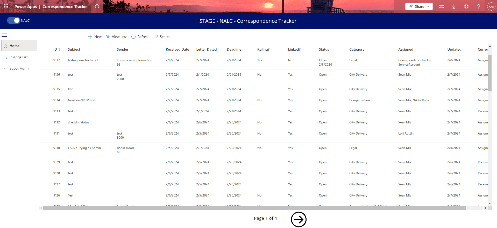
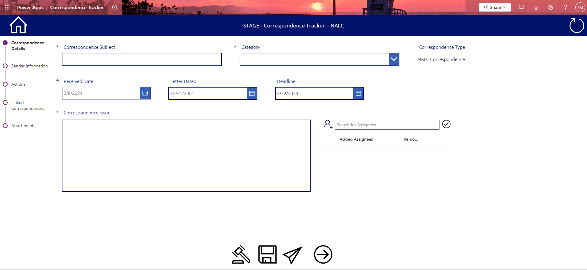
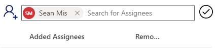

# NALC and USPS Correspondence application documentation

## New NALC Correspondence

1. To begin, click on the "+ New" button

2. Here you can see the Correspondence Details form, with textboxes for Subject and Issue, a dropdown for Category, and date pickers for Received, Letter Dated, and Deadline dates

 
3. There is also a picker for Assignees -- you can begin typing the name of the Assignee and their name will appear -- select their name to assign them to this Correspondence, and add as many Assignees as necessary