# NALC and USPS Correspondence application documentation

## New NALC Correspondence
### Create New Correspondence
<kbd></kbd>

To begin, click on the "+ New" button

### Enter Correspondence Details
<kbd></kbd>

Here you can see the Correspondence Details form page, with textboxes for Subject and Issue, a dropdown for Category, and date pickers for Received, Letter Dated, and Deadline dates

### Select Assignee(s)
<kbd></kbd> 

There is also a picker for Assignees -- you can begin typing the name of the Assignee and their name will appear -- select their name to assign them to this Correspondence, and add as many Assignees as necessary

<kbd>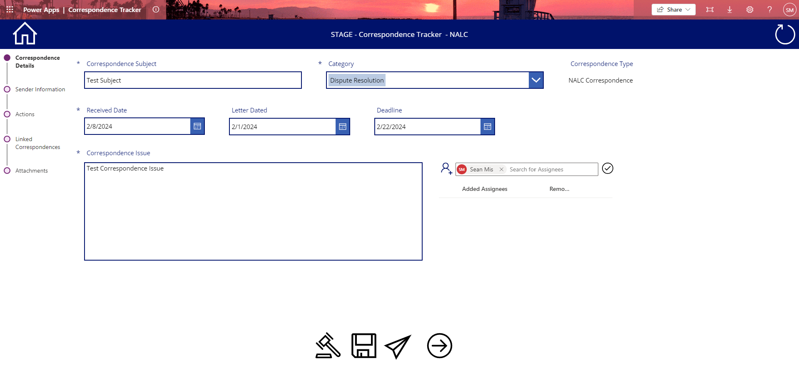</kbd>

After entering all of your text and selecting the Category, dates, and Assignee, you can click on the right arrow (or click on Sender Information on the left side) to progress to Sender Information 

Note: a new NALC Correspondence ID will be created once you click the next arrow or on Sender Information -- until this point, an ID has not been created and your text and selections have not been saved, but your text and selections in Correspondence Details will be saved when you progress to Sender Information

### Sender Information
<kbd>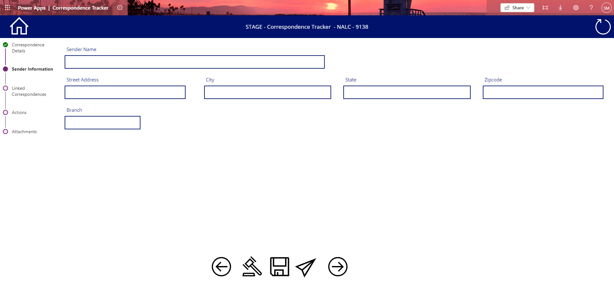</kbd>

Here you can see the Sender Information form page, with textboxes for Sender Name, Street Address, City, State, Zipcode, and Branch

<kbd>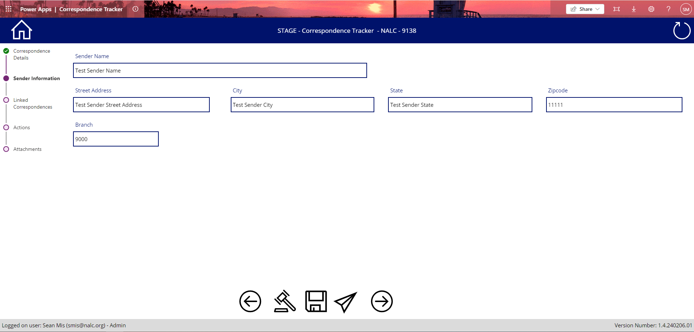</kbd>

After entering all of your text, you can click on the right arrow (or click on Actions) to progress to Actions

### Actions
<kbd></kbd>

Here you can see the page for adding and maintaining Actions

<kbd>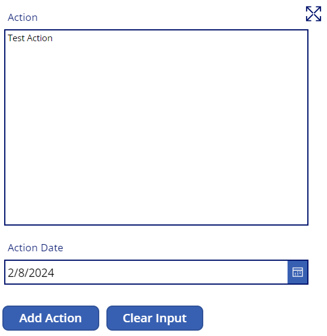</kbd> 

To begin, enter your Action details in the large text box -- click the expand button in the top right corner to see your Action in an expanded view, if necessary -- and select your Action Date from the date picker, then click Add Action to insert your Action in the Action list on the left side of the page

<kbd>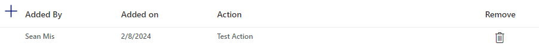</kbd>

Here you can see your Action, with the creator of the Action, date the Action was added, Action details -- you can click on the Remove icon to permanently delete this Action

<kbd>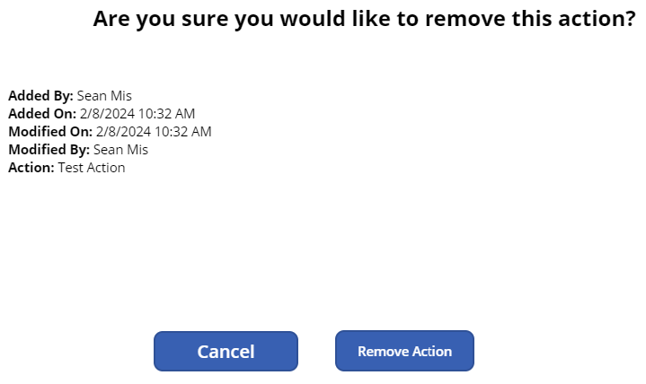</kbd>

If you clicked on the Remove icon you will see this pop-up confirmation screen -- click Remove Action to permanently delete this Action

<kbd>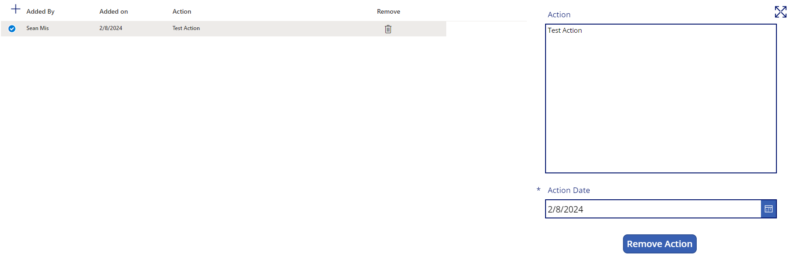</kbd>

Click on the next arrow (or click on Linked Correspondences) to progress to Linked Correspondences

### Linked Correspondences
<kbd>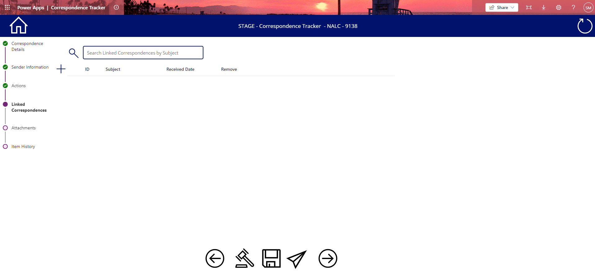</kbd>

Here you can see the page for adding Linked Correspondences to your new Correspondence -- click the plus "+" icon to add a new Linked Correspondence

<kbd>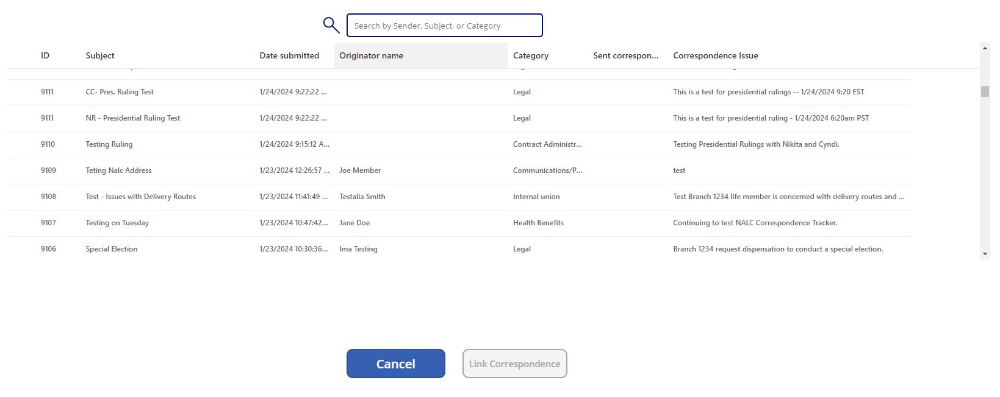</kbd>

Here you can see the list of all Correspondences available to be linked -- double-click on the Correspondence of your choice to link it to your new Correspondence -- you can search for any Correspondence by beginning to type in any details of the Correspondence that you're looking for: Sender Name, Subject, or Category

<kbd>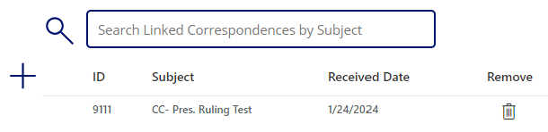</kbd>

Here you can see the Correspondence that you selected and that is now linked to your new Correspondence

<kbd>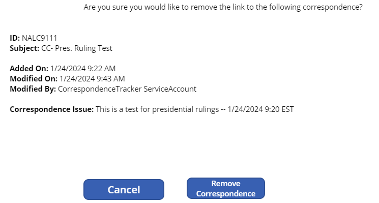</kbd>

To delete a linked Correspondence, click the Remove icon, and you will see this pop-up confirmation screen -- click Remove Correspondence to permanently delete this link to another Correspondence

### Attachments
<kbd>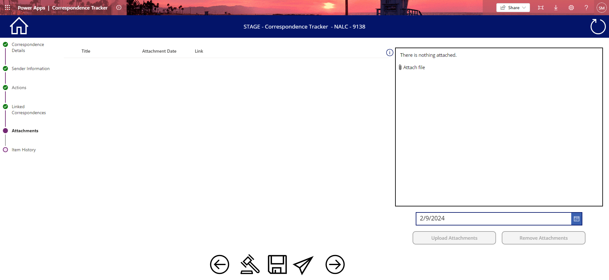</kbd>

Here you can see the page for adding Attachments to your new Correspondence -- click the paperclip/Attach file to Word or PDF files

<kbd>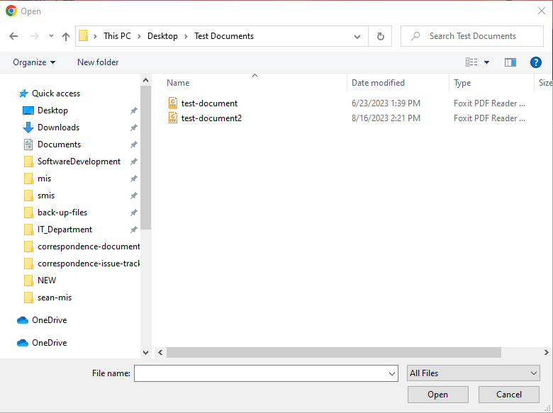</kbd>

Here you can see Windows Explorer window that allows you to navigate to the file of your choice on your local PC -- click OK when you've located and selected the file

<kbd>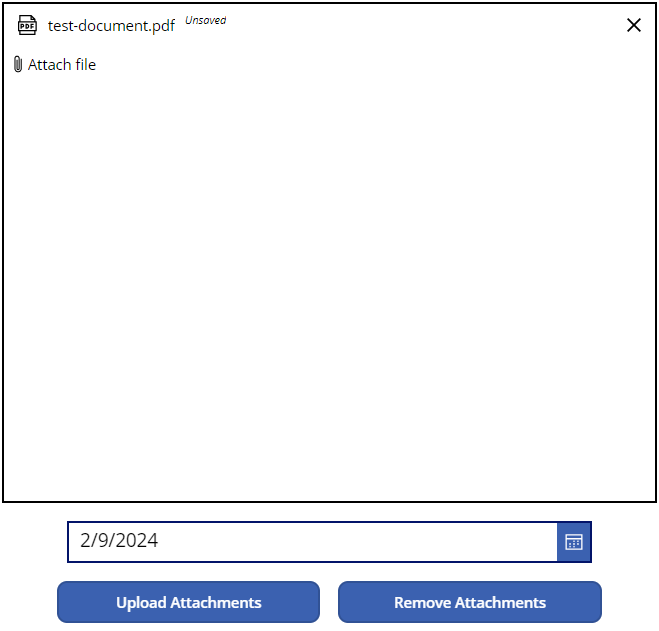</kbd>

Now you can see the file name, with the text "Unsaved" -- add any additional attachments necessary for this new Correspondence

<kbd>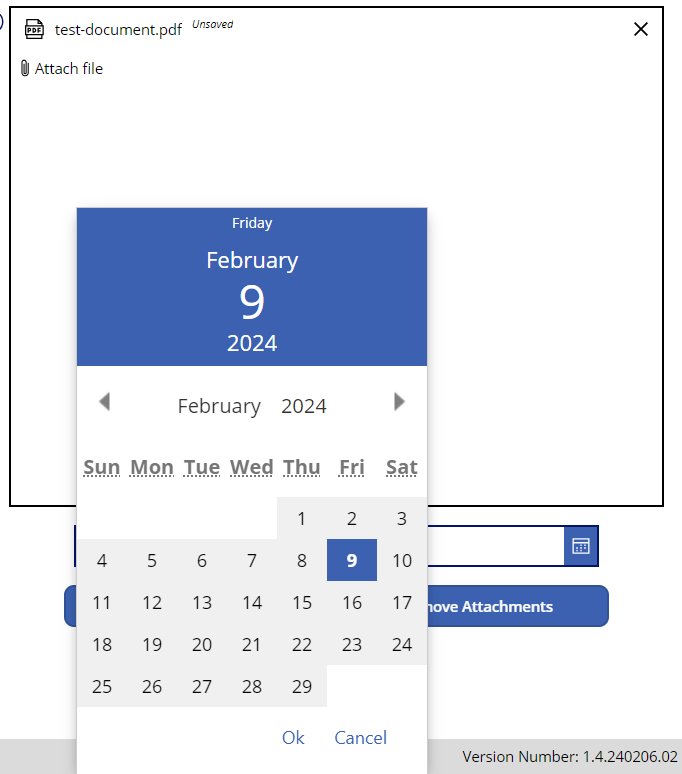</kbd>

To select a date to be associated with your uploaded Attachment(s) click on the date picker and select a date of your choice

<kbd>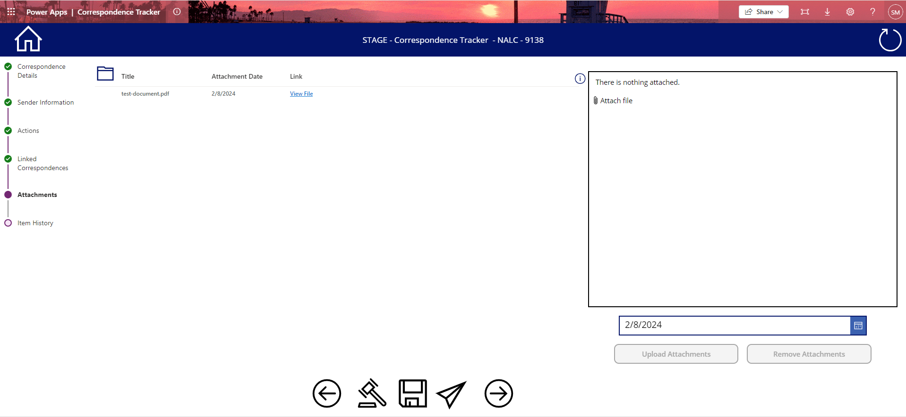</kbd>

After selecting a date and then clicking the Upload Attachments button, you can now see your attachments in the list on the left side of the page

<kbd>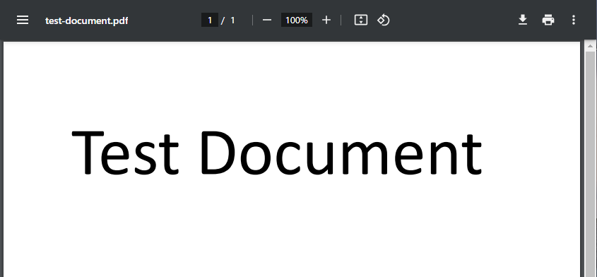</kbd>

You can click on the View File link to view the uploaded file -- a new browser tab will open and your document will appear

<kbd>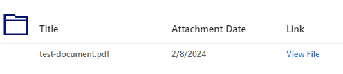</kbd>

To view your upload in SharePoint, you can click on the blue folder icon in the top left corner (near the Title and Attachment Date of your attachment)

<kbd>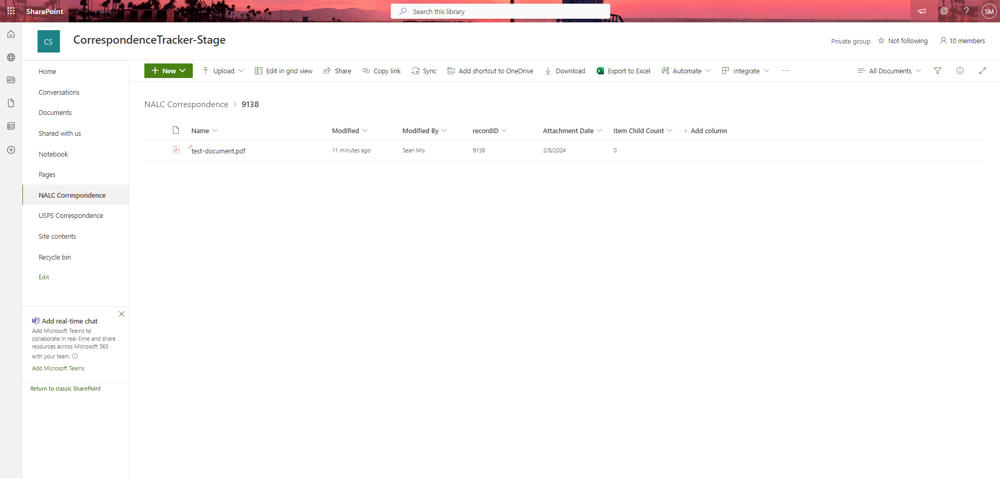</kbd>

To view your upload in SharePoint, you can click on the blue folder icon in the top left corner (near the Title and Attachment Date of your attachment)

### Item History
<kbd>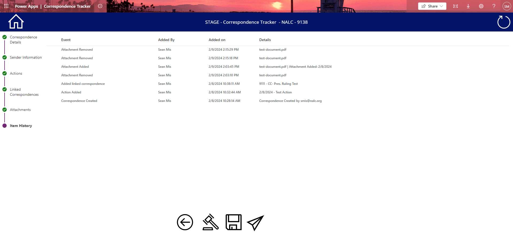</kbd>

Here you can see all the events in the Item History -- every executable action during the creation of your new Correspondence can be seen here

## Edit NALC Correspondence
### Select Correspondence to Edit
<kbd></kbd>

To begin, double click on the row of the Correspondence that you would like to edit

NOTE: You can search for the Correspondence that you'd like to edit by typing in the ID in the search bar, or you can search by Category, Subject, etc.

### Edit Correspondence Details
<kbd>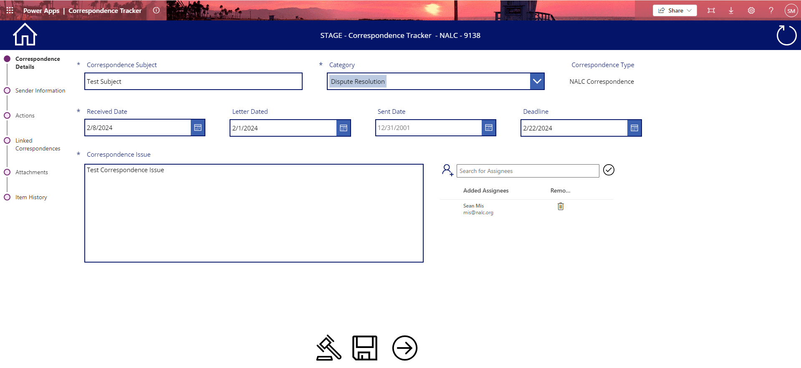</kbd>

Here you can see all the fields populated with data for the Correspondence that you're editing -- begin typing in the Subject or Issue text boxes to update the data, select a new Category from the drop-down, change the dates from the date pickers, or search for and add a new Assignee -- click the next arrow to save and continue editing, or the "Disk" icon to save and exit

### Edit Sender Information
<kbd>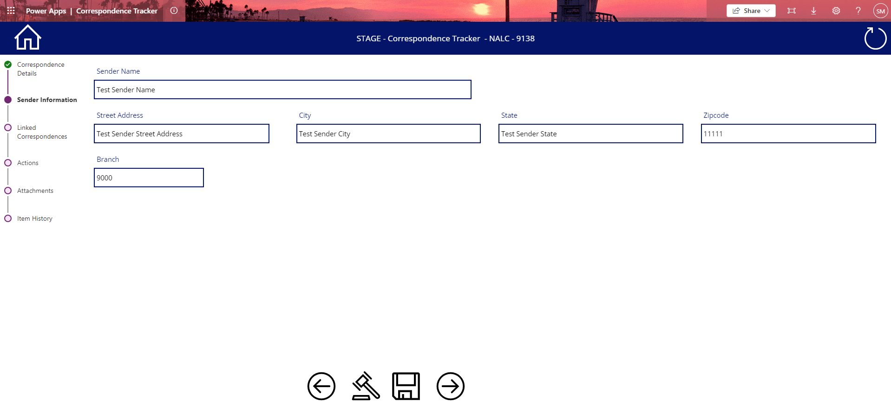</kbd>

Here you can see all the fields populated with data for the Sender: Name, Address, City, State, Zipcode, and Branch -- begin typing in any of the fields to update the data -- click the next arrow to save and continue editing, or the "Disk" icon to save and exit

### Edit Actions
<kbd>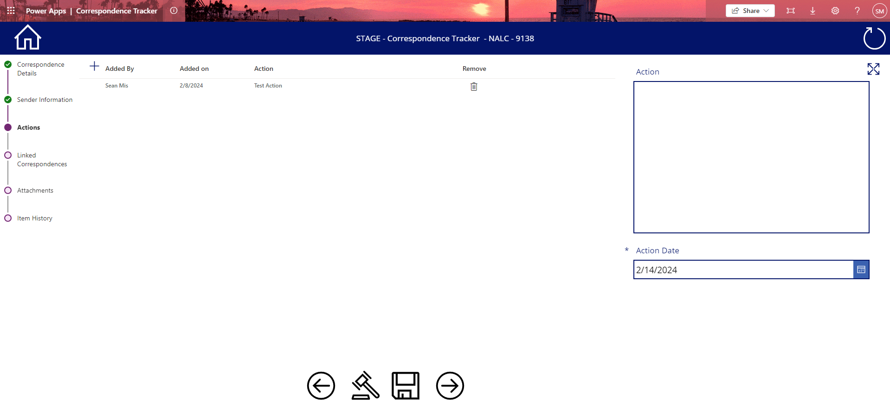</kbd>

Here you can see all of the Actions that were created for this Correspondence -- you can click on the Action and view its details on the right side (where you can update the details or the Action date), you can add a new Action by clicking on the '+' icon in the top right, or you can delete an Action by clicking the remove icon

### Edit Linked Correspondences
<kbd>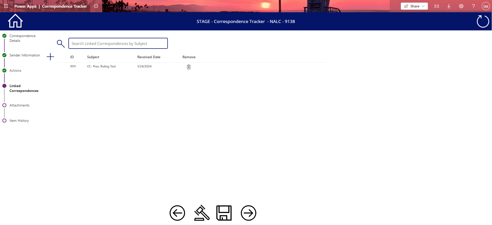</kbd>

Here you can see all of any Correspondences that are linked to the Correspondence that you are editing -- to remove a linked Correspondence, click the remove icon, and to link another Correspondence, click the '+' icon at the top right, and select the Correspondence of your choice  -- you can search for any Correspondence by beginning to type in any details of the Correspondence that you're looking for: Sender Name, Subject, or Category

### Edit Attachments
<kbd>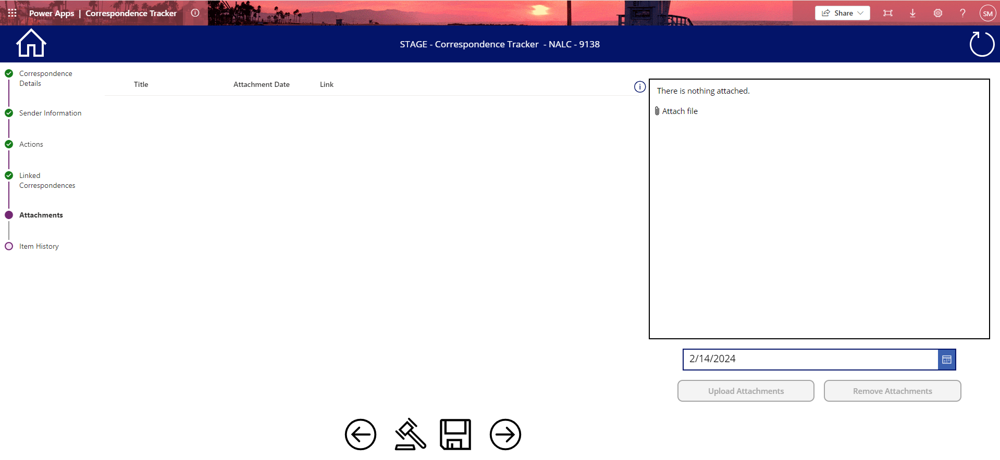</kbd>

Here you can see any files that were attached to this Correspondence -- you can remove an attachment by selecting it and then clicking the Remove Attachments button on the bottom right side -- you can add a new Attachment by clicking on Attach file and browsing your local PC for the file of your choice

### Item History Edits
<kbd>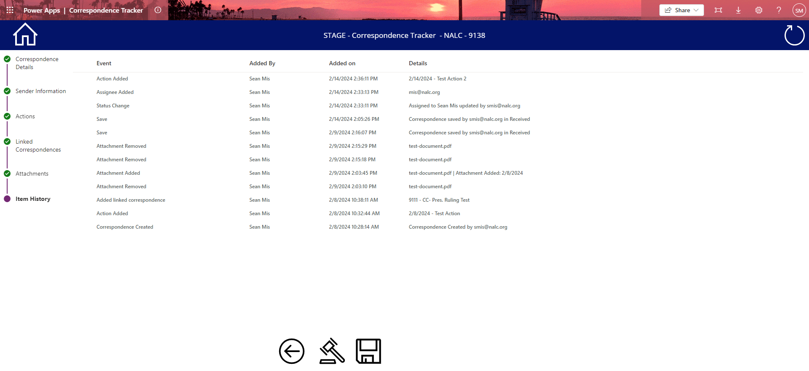</kbd>

Here you can the original item history as well as any additional edits made to this Correspondence

## Presidential Rulings
### Create New Presidential Ruling
<kbd></kbd>

To begin, from inside the Correspondence of your choice you can click on the Gavel icon, and this action will take you to a new Presidential Ruling that will be associated with your NALC Correspondence

<kbd>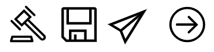</kbd>

### Presidential Ruling Details
<kbd>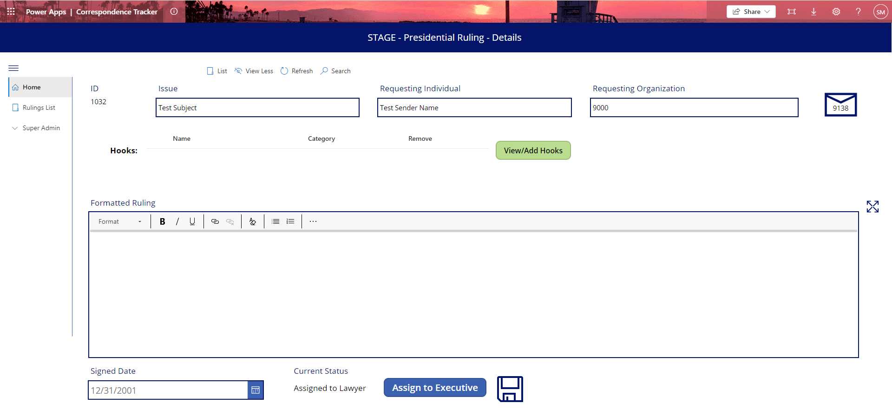</kbd>

Here you can see the entry screen for creating your Presidential Ruling, with textboxes for the Issue, Requesting Individual, Requesting Organization, and Formatted Ruling, as well as a date picker for the Signed Date

### View/Add Hooks
<kbd>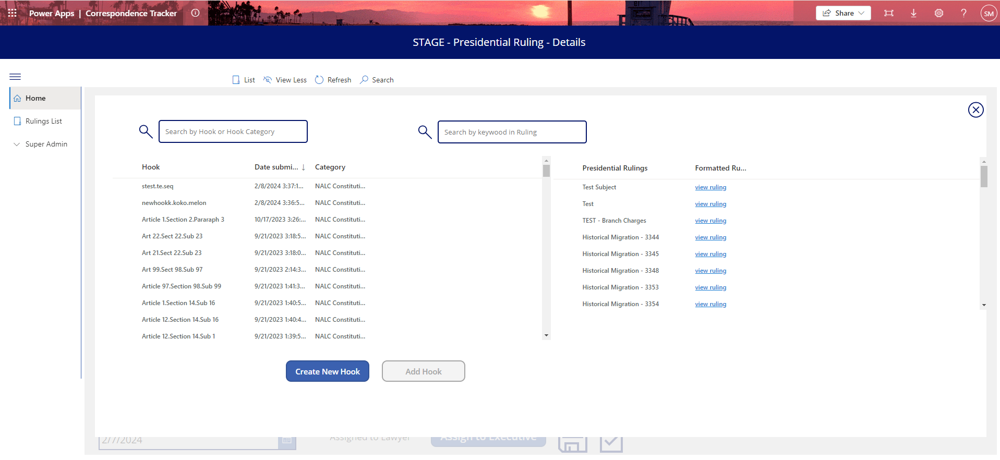</kbd>

To add a new or view a hook, click on the green View/Add Hooks button -- here you can see the list of previously created Hook (if any) -- to create a new hook, click the Create New Hook button

### New Hook Details
<kbd>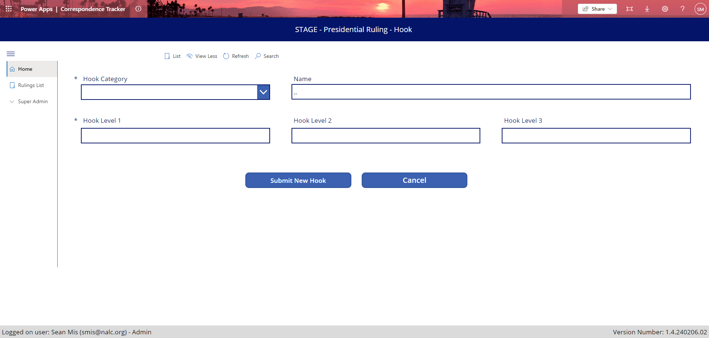</kbd>

To add details for your hook, select a Category from the drop down and Hook Levels 1-3 in the textboxes

NOTE: the Hook Name will self-populate based on the descriptions entered for Hook Levels 1-3

<kbd>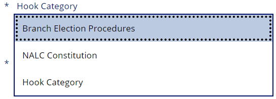</kbd>

Here you can see the different Hook Categories to choose from

<kbd>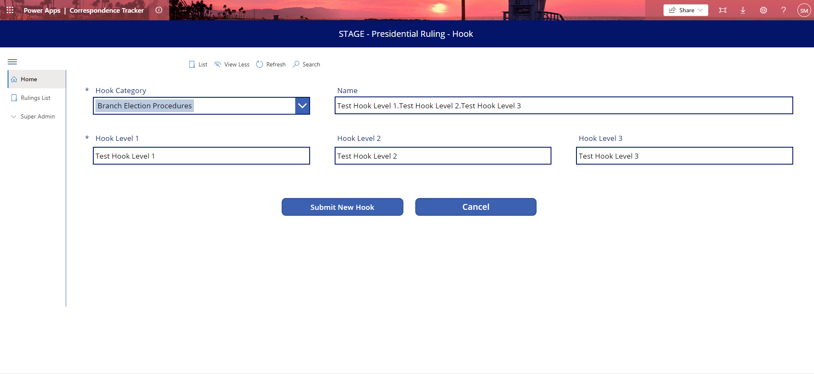</kbd>

Here you can see the filled out form for creating a new Hook -- note how the Name is Hook Levels 1-3, appended with two periods

<kbd>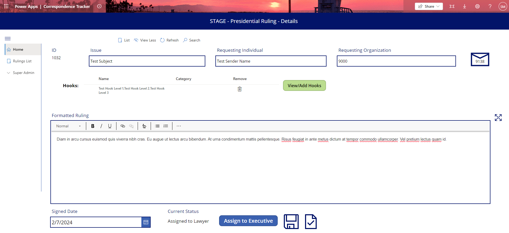</kbd>

Back on the Details page, you can add a Formatted Ruling and select a Signed Date from the date picker, and you can either: save and return to your Presidential Ruling at another time; or you can click Assign to Executive to notify the executive that they have a new Presidential Ruling to review

## New USPS Correspondence
### Create New Correspondence
<kbd>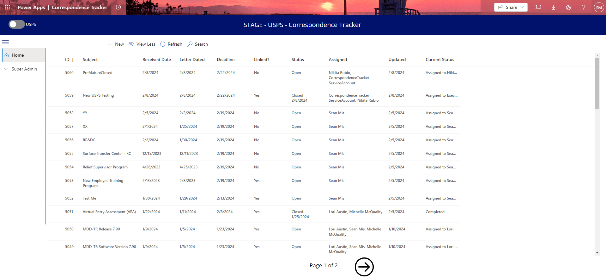</kbd>

To begin, click on the "+ New" button

### Enter Correspondence Details
<kbd>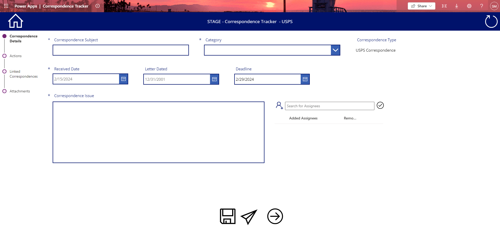</kbd>

Here you can see the Correspondence Details form page, with textboxes for Subject and Issue, a dropdown for Category, and date pickers for Received, Letter Dated, and Deadline dates

### Select Assignee(s)
<kbd>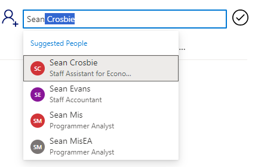</kbd> 

There is also a picker for Assignees -- you can begin typing the name of the Assignee and their name will appear -- select their name to assign them to this Correspondence, and add as many Assignees as necessary

<kbd>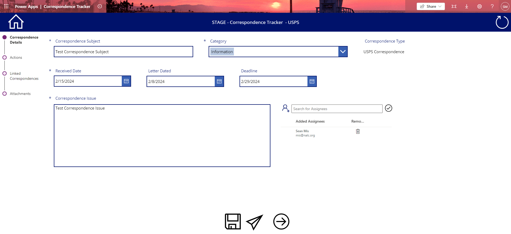</kbd>

After entering all of your text and selecting the Category, dates, and Assignee, you can click on the right arrow (or click on Sender Information on the left side) to progress to Sender Information 

Note: a new NALC Correspondence ID will be created once you click the next arrow or on Sender Information -- until this point, an ID has not been created and your text and selections have not been saved, but your text and selections in Correspondence Details will be saved when you progress to Sender Information

### Actions
<kbd>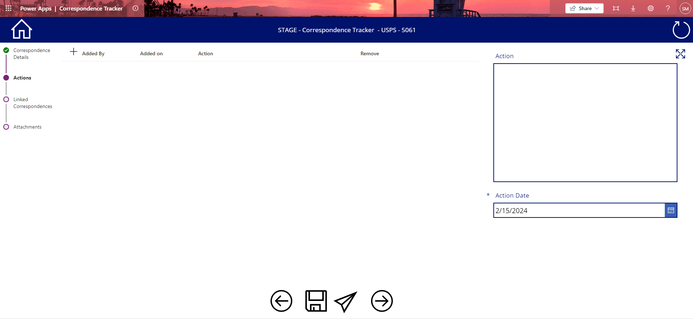</kbd>

Here you can see the page for adding and maintaining Actions

<kbd>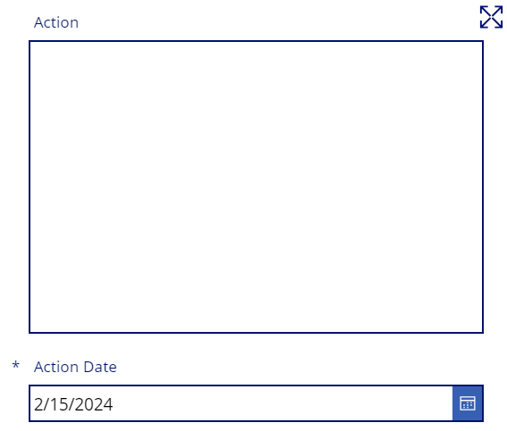</kbd> 

To begin, enter your Action details in the large text box -- click the expand button in the top right corner to see your Action in an expanded view, if necessary -- and select your Action Date from the date picker, then click Add Action to insert your Action in the Action list on the left side of the page

<kbd>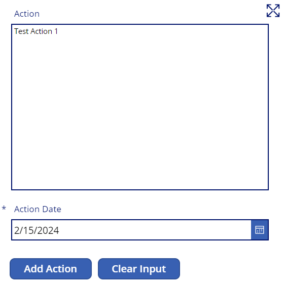</kbd>

Here you can see your Action, with the creator of the Action, date the Action was added, Action details -- you can click on the Remove icon to permanently delete this Action

<kbd>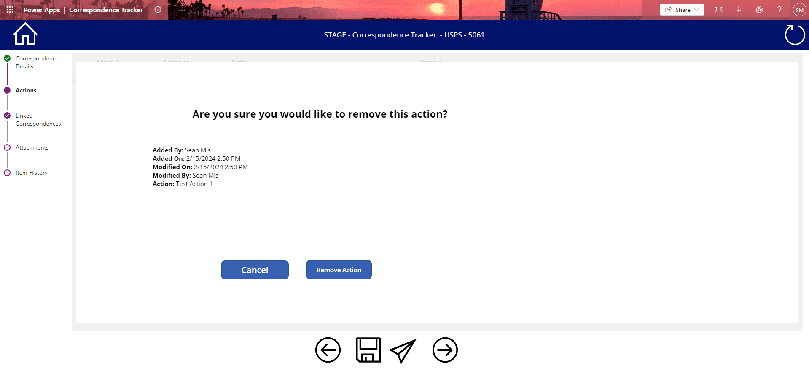</kbd>

If you clicked on the Remove icon you will see this pop-up confirmation screen -- click Remove Action to permanently delete this Action

<kbd>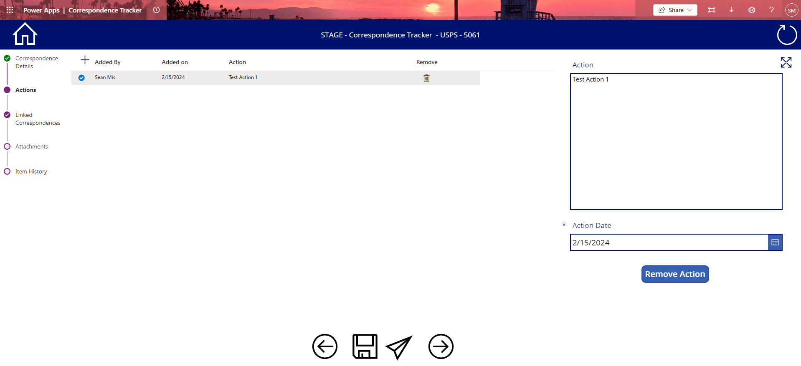</kbd>

Click on the next arrow (or click on Linked Correspondences) to progress to Linked Correspondences

### Linked Correspondences
<kbd>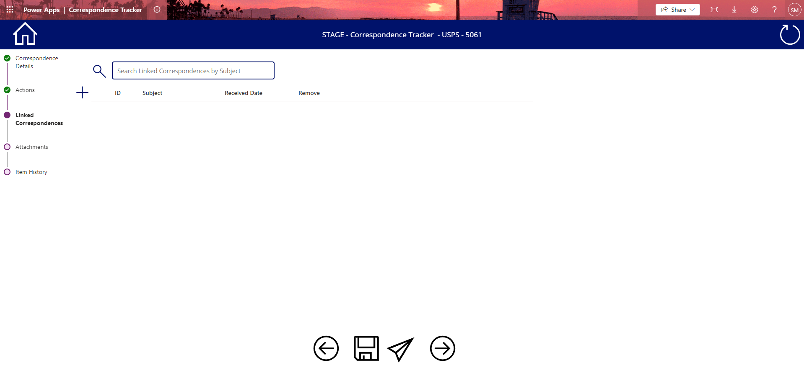</kbd>

Here you can see the page for adding Linked Correspondences to your new Correspondence -- click the plus "+" icon to add a new Linked Correspondence

<kbd>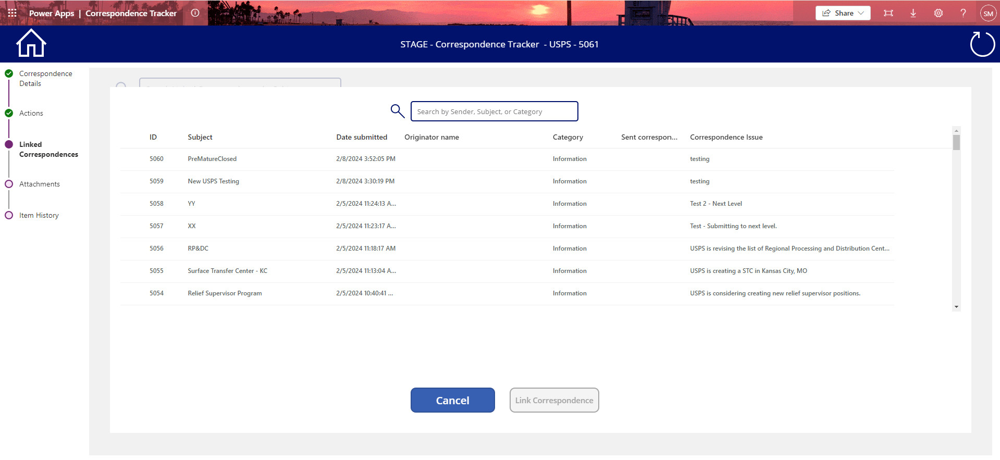</kbd>

Here you can see the list of all Correspondences available to be linked -- double-click on the Correspondence of your choice to link it to your new Correspondence -- you can search for any Correspondence by beginning to type in any details of the Correspondence that you're looking for: Sender Name, Subject, or Category

<kbd>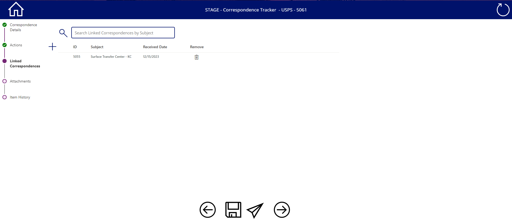</kbd>

Here you can see the Correspondence that you selected and that is now linked to your new Correspondence

<kbd>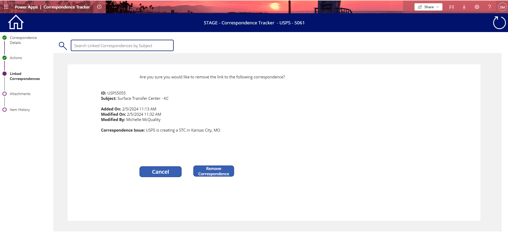</kbd>

To delete a linked Correspondence, click the Remove icon, and you will see this pop-up confirmation screen -- click Remove Correspondence to permanently delete this link to another Correspondence

### Attachments
<kbd>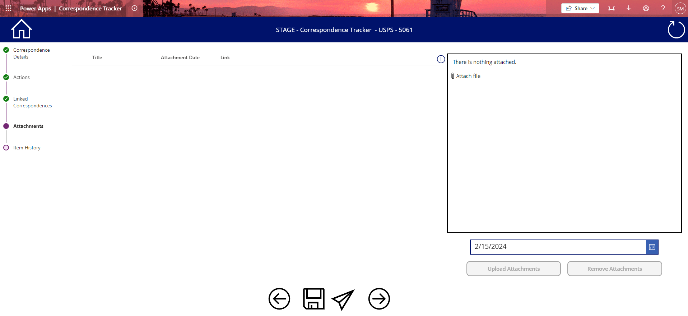</kbd>

Here you can see the page for adding Attachments to your new Correspondence -- click the paperclip/Attach file to Word or PDF files

<kbd>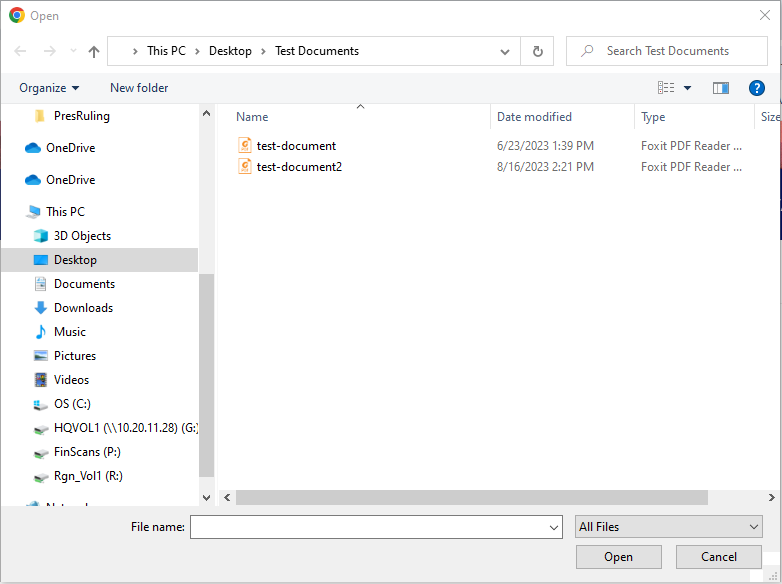</kbd>

Here you can see Windows Explorer window that allows you to navigate to the file of your choice on your local PC -- click OK when you've located and selected the file

<kbd>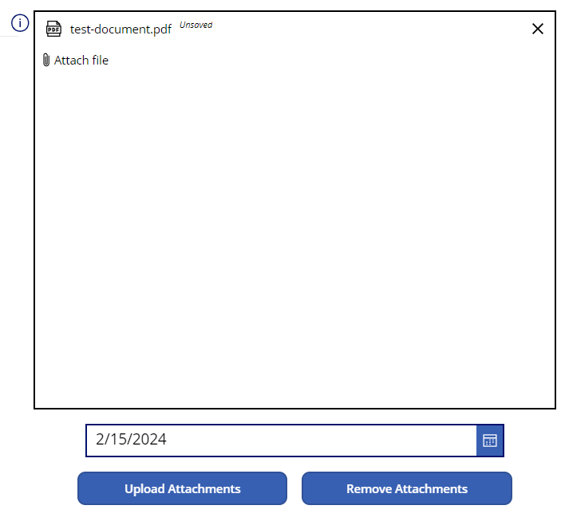</kbd>

Now you can see the file name, with the text "Unsaved" -- add any additional attachments necessary for this new Correspondence

<kbd></kbd> 

To select a date to be associated with your uploaded Attachment(s) click on the date picker and select a date of your choice

<kbd>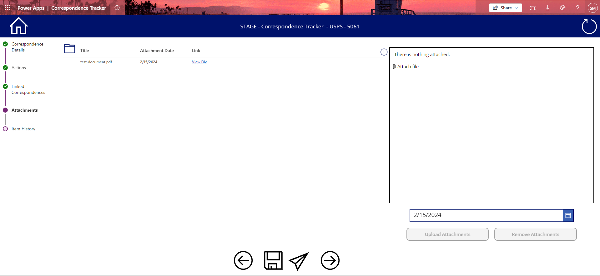</kbd>

After selecting a date and then clicking the Upload Attachments button, you can now see your attachments in the list on the left side of the page

<kbd>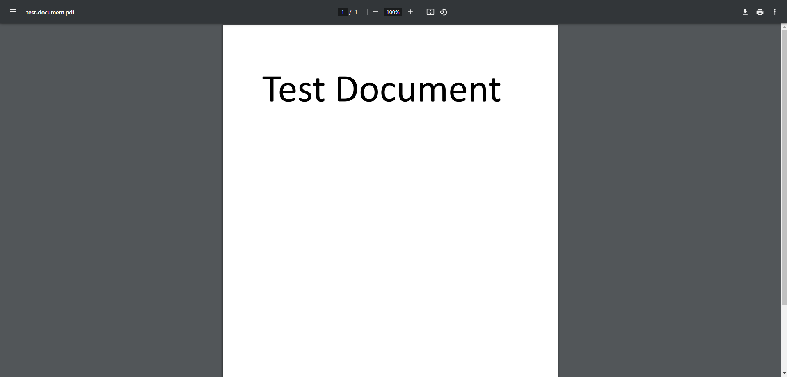</kbd>

You can click on the View File link to view the uploaded file -- a new browser tab will open and your document will appear

<kbd>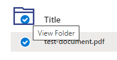</kbd>

To view your upload in SharePoint, you can click on the blue folder icon in the top left corner (near the Title and Attachment Date of your attachment)

<kbd>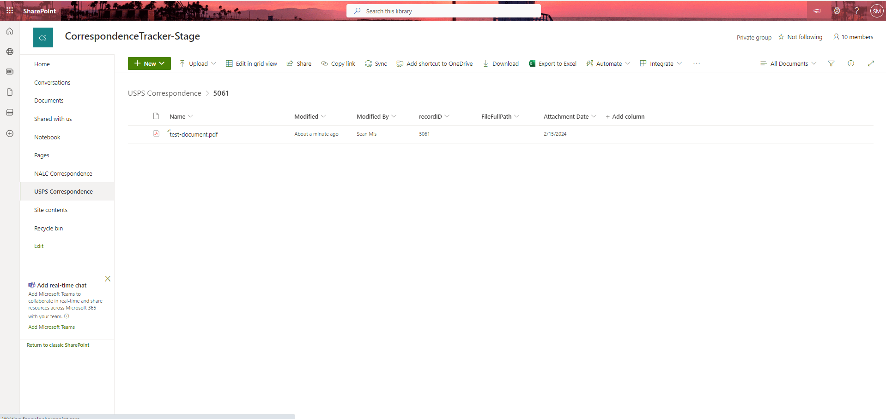</kbd>

Here you see in SharePoint all files that are associated with your Correspondence

### Item History
<kbd>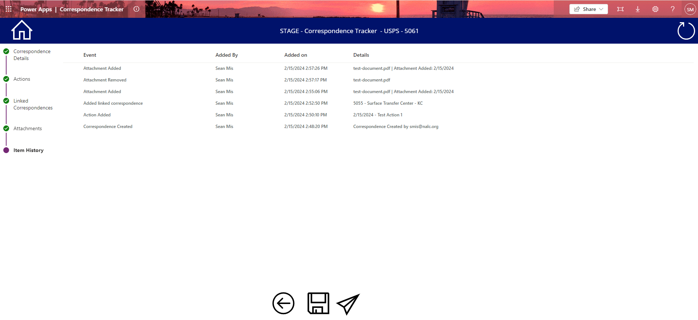</kbd>

Here you can see all the events in the Item History -- every executable action during the creation of your new Correspondence can be seen here

## Edit NALC Correspondence
### Select Correspondence to Edit
<kbd></kbd>

To begin, double click on the row of the Correspondence that you would like to edit

NOTE: You can search for the Correspondence that you'd like to edit by typing in the ID in the search bar, or you can search by Category, Subject, etc.

### Edit Correspondence Details
<kbd>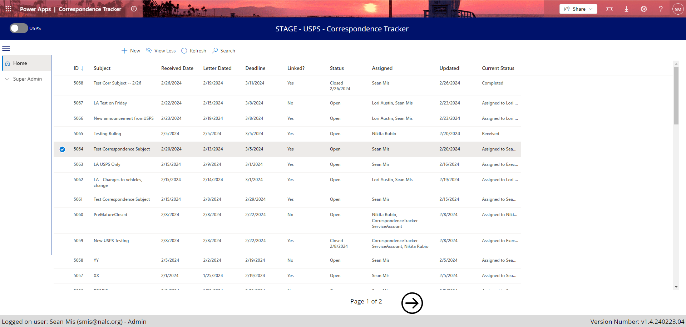</kbd>

Here you can see all the fields populated with data for the Correspondence that you're editing -- begin typing in the Subject or Issue text boxes to update the data, select a new Category from the drop-down, change the dates from the date pickers, or search for and add a new Assignee -- click the next arrow to save and continue editing, or the "Disk" icon to save and exit

### Edit Actions
<kbd>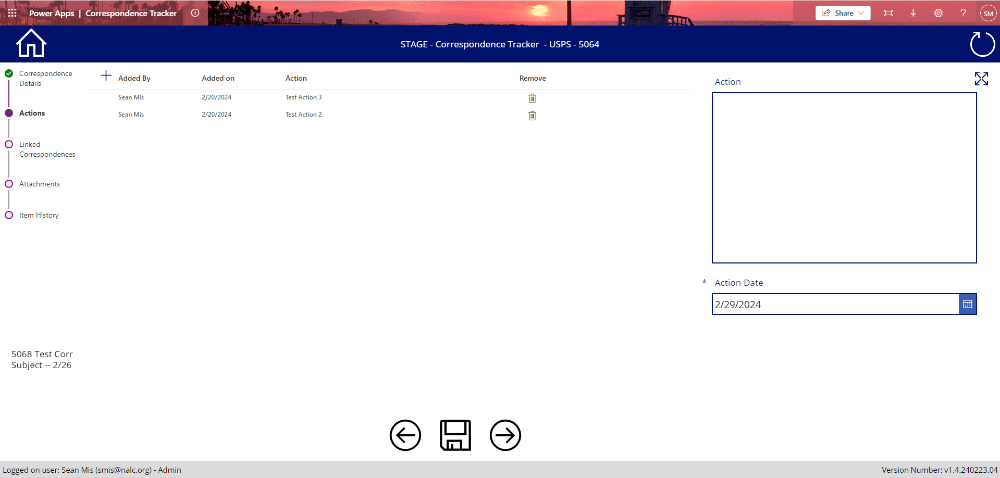</kbd>

Here you can see all of the Actions that were created for this Correspondence -- you can click on the Action and view its details on the right side (where you can update the details or the Action date), you can add a new Action by clicking on the '+' icon in the top right, or you can delete an Action by clicking the remove icon

### Edit Linked Correspondences
<kbd>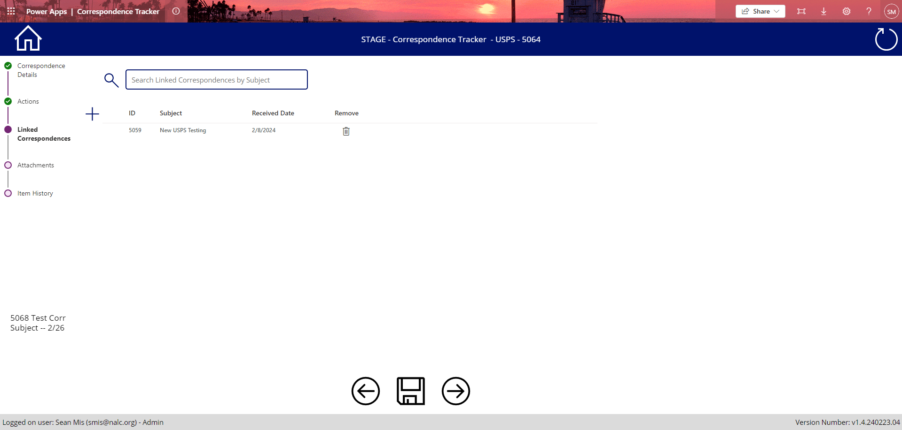</kbd>

Here you can see all of any Correspondences that are linked to the Correspondence that you are editing -- to remove a linked Correspondence, click the remove icon, and to link another Correspondence, click the '+' icon at the top right, and select the Correspondence of your choice  -- you can search for any Correspondence by beginning to type in any details of the Correspondence that you're looking for: Sender Name, Subject, or Category

### Edit Attachments
<kbd>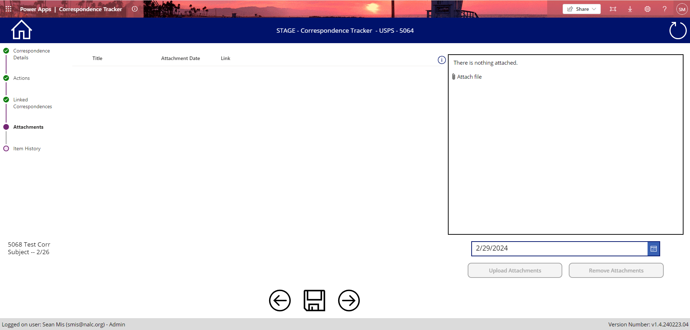</kbd>

Here you can see any files that were attached to this Correspondence -- you can remove an attachment by selecting it and then clicking the Remove Attachments button on the bottom right side -- you can add a new Attachment by clicking on Attach file and browsing your local PC for the file of your choice

### Item History Edits
<kbd>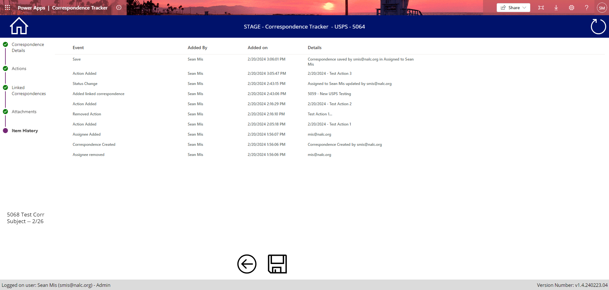</kbd>

Here you can the original item history as well as any additional edits made to this Correspondence